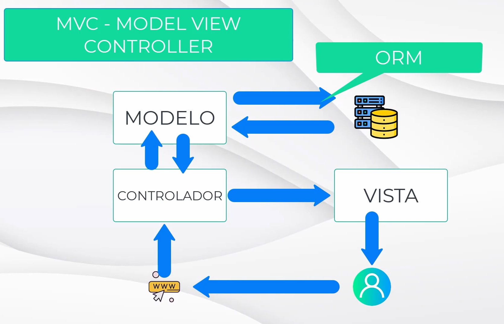
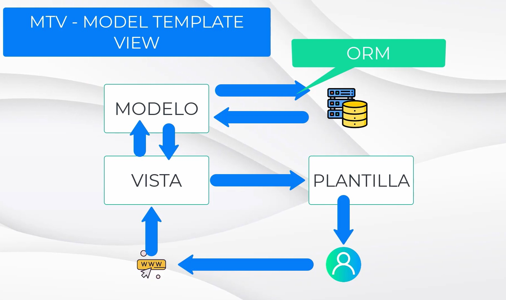
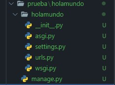
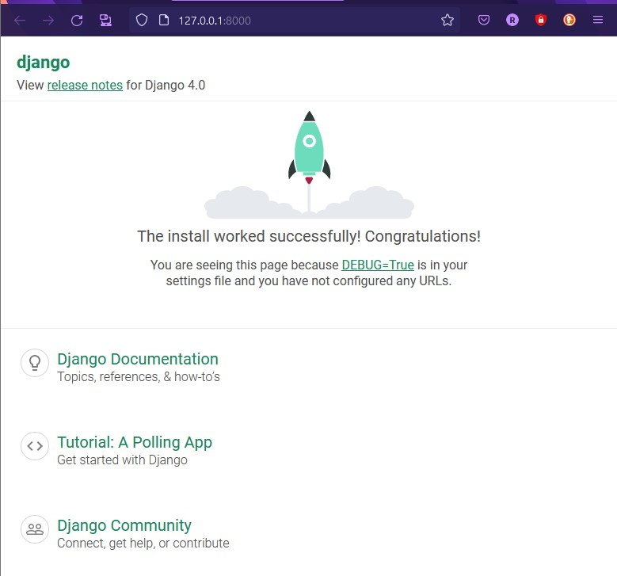
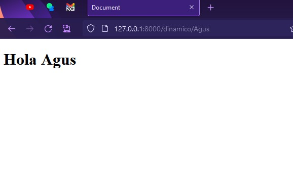
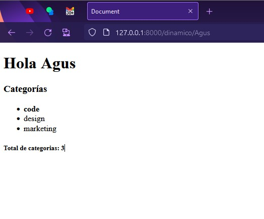

# Django - Introducción

## Presentación

Profe: Juan José Ruiz
Desarrollo web con python Django

### Que vamos a aprender?

- Conceptos básicos
- Arquitectura
- Modelar datos
- Hacer consultas
- Hacer templates
- Usar el panel de administración

Que es necesario saber:

- python
- html
- css

## Instalación

### Requerimientos de software

- python
- pip
- django

### Comprobamos que django esta instalado

Para ello vamos a crear un proyecto de prueba para comprobar, que se ha instalado correctamente. Usando el comando:

```powershell
django-admin startproject holamundo
```

Si django se ha ejecutado de forma correcta veremos en la carpeta que ejecutamos el comando, que se creo una carpeta con el nombre del proyecto, y una estructura interna de archivos y directorios.

## Patrón de arquitectura

Django es un framework gratuito hecho en python
Un framework es un conjunto de herramientas, librerías y estructura, que nos permite trabajar de forma ágil. A la hora de trabajar en el desarrollo web no es necesario estar inventando la rueda, si no que nos ayudamos de los frameworks para reutilizar herramientas, y desarrollar ágilmente.

En el desarrollo web, hay partes que siempre se repiten, como los son:

- un tablero de control
- servicio de login y autenticación de usuarios
Todas estas acciones son comunes en el desarrollo web.

Ademas django nos facilitara una estructura de arquitectura de nuestra pagina.

### Patrón MVC


En este modelo lo que tenemos es un usuario, que realiza una petición a una url, es decir esta en el navegador y escribe la dirección de una pagina web.
Entonces lo que ocurre, es que se accede a un diccionario de urls, donde asocia cada una de estas urls a un controlador.
El controlador, es el que sabe lo que tiene que realizar.

Por ejemplo, si uno esta accediendo a un blog, el controlador asociado a esa url, tendrá las funciones esenciales, como pueden ser, consultar los últimos posts, recabar toda la información necesaria.
El controlador llamara a los modelos. El modelo es una abstracción de los datos que tenemos en nuestra base de datos. Y el modelo puede ser tratado como una clase, pudiendo de esta manera abstraerse de la base de datos, que queda en un segundo plano, y utilizar las propiedades definidas de la clase modelo.
El modelo al final, esta conectado a la base de datos y interactúa con ella, mediante un **ORM**(object relational mapping).
Nosotros manipulamos los objetos del modelo, y es el orm quien se encarga de leer, escribir y trabajar con la base de datos.
En el ejemplo, nuestro modelo obtiene los datos  mediante el el orm de la base de datos, y el controlador puede ver los objetos obtenidos por el modelo, y de esa forma el controlador obtiene los datos.
Una vez que el controlador obtiene los datos, lo que hace es pasar esos datos a la vista.
La vista obtiene los datos, y es la que se encarga de mostrar los datos en pantalla.

Los controladores contiene la lógica y la vista tiene las plantillas donde se despliegan los datos.

De esta arquitectura mvc es de donde deriva la arquitectura de django mtv.

### Patrón de arquitectura MTV

MTV (model template view)
Los mcv son pensados en un principio para componentes más pequeños, y mtv para estructuraras de componentes o aplicaciones mas grandes. por eso django decidió renombrarlas para evitar la polémica.

En esta funciona exactamente igual, solo que a los controladores los vamos a llamar vistas y a las vistas templates/plantillas.


## Estructura de archivos

En la carpeta del proyecto veremos un archivo `manage.py` y una carpeta que es del mismo nombre de un proyecto. Django se divide en aplicaciones, estas serán carpetas.
El archivo `manage.py` es muy importante, pero no es un archivo que nosotros vallamos a modificar, este se encarga de ponernos a disposición la estructura de nuestro proyecto para que podamos desde la terminal trabajar con comandos propios de django. Es el que nos va a permitir gestionar nuestro proyecto.

Es importante recordar que django nos permite gestionar nuestro proyecto de forma modular, por lo tanto podemos tener varias aplicaciones, cada aplicación se gestiona como un paquete.

Ahora de manera de ejemplo vamos a entrar a nuestra aplicación `holamundo`, en nuestro proyecto de prueba `holamundo`, dentro de ella podemos ver la estructura de archivos que nos ha generado django.


Cada una de las aplicaciones debe contener en su directorio un archivo `__init__.py`, para que podamos gestionar cada aplicación como un paquete.
Tenemos  dentro de esta estructura dos archivos que nos van a ayudar con el servidor de pruebas y otro tipo de acciones de pruebas, que estarán `asgi.py` y `wsgi.py`.

Luego tenemos los archivos que si vamos a estar manipulando `settings.py` y `urls.py`.

### `urls.py`

Este archivo se va encargar de asociar las direcciones url con las vistas/views.
En este archivos tenemos una lista que se llama `urlpatterns`, donde vamos a ir escribiendo todas las urls asociadas a las vistas con las que las vamos a ir controlando.

### `settings.py`

En este archivo vamos a poner las configuraciones del paquete. Dentro de este archivo hay una lista llamada `INSTALLED_APPS`, donde tendremos las aplicaciones que vienen instaladas por defecto.
También podremos ver los templates, los midwares(aquí encontraremos aps de seguridad.)

También podremos configurar las conexiones con la base de datos y el motor controlador.

#### Installed_apps

- `django.contrib.admin`
Este sirve para establecer un panel de control de administración.
- `django.contrib.auth`
Para gestionar las autenticaciones y los usuarios
- `django.contrib.contenttypes`
Para los diferentes tipos de contenidos
- `django.contrib.sessions`
Para gestionar las sesiones.
- `django.contrib.messages`
Para gestionar los mensajes
- `django.contrib.staticsfiles`
Para controlar la carga de archivos estáticos

## Primer Hola mundo en Django

En el archivo `urls.py`, lo que hacemos es asociar cada una de las rutas de nuestro proyecto con una vista.

Debemos crear nuestro archivo de vistas, para controlar la ruta, y vamos a devolver un mensaje http para comprobar un circuito completo de esta arquitectura.

Lo primero que debemos hacer es entrar a la una consola, en la dirección de nuestro proyecto.
Y vamos a crear la estructura de base de datos necesaria para poder funcionar.
Para eso django lo que tiene que hacer es migrar los modelos de datos que tenemos al sistema de permanencia de datos.
Para ello se utiliza el comando `migrate`.
Este comando se utilizara cada vez que modifiquemos el modelo de la estructura de datos.

De manera de prueba, utilizaremos el motor SQLlite, y luego en un entorno de producción mudaremos a postgre.

Debemos recodar que el archivo `manage.py`, es el que debemos llamar siempre que queramos realizar una acción en nuestro proyecto. Osea que la instrucción sera a través de ese archivo.

```powershell
PS C:\rep\open_boot_camp\django\prueba\holamundo>python manage.py migrate
Operations to perform:
  Applying auth.0004_alter_user_username_opts... OK
  Applying auth.0005_alter_user_last_login_null... OK
  Applying auth.0006_require_contenttypes_0002... OK
  Applying auth.0007_alter_validators_add_error_messages... OK
  Applying auth.0008_alter_user_username_max_length... OK
  Applying auth.0009_alter_user_last_name_max_length... OK
  Applying auth.0010_alter_group_name_max_length... OK
  Applying auth.0011_update_proxy_permissions... OK
  Applying auth.0012_alter_user_first_name_max_length... OK
  Applying sessions.0001_initial... OK
```

> Siempre los comandos deben realizarse desde la ubicación del archivo `manage.py`

Al ejecutar el comando, django debería habernos creado una base de datos.
> La extension para poder ver la base de datos SQLlite, SQLtools SQLlite.

### Comprobar el proyecto con el servidor de pruebas

Para poder ejecutar el proyecto en el servidor de pruebas, usaremos el comando `python manage.py runserver`.

Al ejecutar el comando debería levantarnos un servidor, y devolver por consola este mensaje:

```powershell
PS C:\rep\open_boot_camp\django\prueba\holamundo> python manage.py runserver

Performing system checks...

System check identified no issues (0 silenced).
December 20, 2022 - 12:00:01
Django version 4.0.4, using settings 'holamundo.settings'
Starting development server at http://127.0.0.1:8000/
Quit the server with CTRL-BREAK.
```

Al hacer click en el enlace ip del servidor, debería abrirnos una pagina en el navegador, si todo salio bien, veremos el siguiente mensaje.


Y para interrumpir la ejecución del servidor debemos apretar `ctrl`+`C`.

### Ahora vamos a hacer nuestro primer Hola Mundo

Para ello vamos a necesitar un archivo de vistas `views.py`. Que es donde vamos a declarar las vistas con las que vamos a trabajar.

Las vistas son muy sencillas, son las que van a contener la lógica. Mediante una colección de funciones. Es decir dentro de una vista vamos a tener diferentes funciones, y van a estar relacionadas cada una con una url, en el archivos `urls.py`.

```python
# views.py
from django.http import HttpResponse  # Para utilizarla debe ser importada

"""
 Para definir una vista, se utiliza la definición de funciones,
en django, las vistas siempre van a tener al menos un parámetro "request", que es la petición, que recibiremos de nuestra url, la petición de ejecutar esta vista.

El request es importante, ya que si bien en este ejemplo, solo see mostrara un mensaje, el parámetro request podrá devolver información de interés. Como puede ser datos de autenticación, datos de formulario.
"""
def saludo(request):
    return HttpResponse("Hola Mundo")
```

Una vez creada la vista debemos, asociar esa vista a una url.
En el archivo `urls.py`, dentro de la lista `urlpatterns` vamos a crear un nuevo path.

```python
# urls.py

from django.contrib import admin
from django.urls import path
from . import views  # debemos importar el archivo views

urlpatterns = [
    path('admin/', admin.site.urls),
    path('saludo/', views.saludo, name='saludo')  # Y vincular la función con una ruta
]

```

Una vez realizados estos cambios en los archivos, podemos ejecutar nuestro live server y comprobar que en la dirección `ip/saludo/` se muestra el texto indicado en la vista.

# Rutas y plantillas

## Rutas con parámetros

Las rutas con parámetros nos vana permitir, recepcionar variables a través de la url que vamos a poder utilizar en nuestra vista.
Hasta el momento todas las rutas que hemos agregado al proyecto "Hola mundo", son rutas estáticas. No están recibiendo ninguna información de la url.

En django para poder recibir variables a través de la ruta, debemos agregarlas encerradas entre `<>`, e indicar el tipo de variable, dos puntos seguido de su nombre de variable.

```python
# urls.py
from django.contrib import admin
from django.urls import path
from . import views

urlpatterns = [
    path('admin/', admin.site.urls),
    path('saludo/', views.saludo, name='saludo'),
    path('despedida/', views.despedida, name='despedida'),
    path('adulto/<int:edad>/', views.adulto, name='adulto')
]

```

```python
# views.py
from django.http import HttpResponse

def saludo(request):
    return HttpResponse('Hola mundo!')

def despedida(request):
    return HttpResponse('Hasta luego')

def adulto(request, edad):
    if edad >= 18:
        return HttpResponse("Eres mayor de edad")
    else:
        return HttpResponse("No eres mayor de edad")

```

Para probar el funcionamiento de la ruta, debemos ejecutar el live server,
y darle la ruta a nuestra vista seguido de el valor de nuestra variable. En este caso podría ser `ip/adulto/18`, y nos llevara a una pagina que tendrá el mensaje de "Eres mayor de edad".

Esto nos sera muy util a la hora de poder, a través de una ruta a una publicación, una noticia, un producto, construyendo la ruta del objeto que deseamos consultar. Para poder empezar a vincular el contenido de forma mas interactiva.

## Uso de plantillas

> Vamos a crear un nuevo proyecto llamado plantillas

En el caso anterior, osea en el proyecto con el que estuvimos trabajando antes, nos salteamos el paso de MVT, de devolver un plantilla al usuario, como respuesta a un consulta, devolvíamos una respuesta Http simple.
Ahora empezaremos a trabajar para devolver una plantilla al usuario.
Esa plantilla sera una colección de archivo HTML. De esta forma lo que logramos es separar la parte visual de nuestro proyecto de la parte lógica.
La parte lógica se encontrara dentro del archivo views, y la parte visual estará en los templates.
Las plantillas nos servirán también, para estructurar nuestro proyecto, de manera que podamos evitar, el uso de código html repetido.
> concepto: herencia de plantillas

Lo primero que debemos hacer es determinar, cual va ser el directorio donde vamos a poner todas nuestra plantillas(nuestros archivos html), en el archivo settings.py.

Dentro de este archivo veremos que tenemos una lista donde se guardaran los parámetros que mirara django para encontrar las plantillas.

```python
# settings.py

TEMPLATES = [
    {
        'BACKEND': 'django.template.backends.django.DjangoTemplates',
        'DIRS': ['templates'],  # este sera el lugar donde agregaremos el nombre de la carpeta que contendrá nuestras plantillas, ene este caso el nombre sera "templates"
        'APP_DIRS': True,
        'OPTIONS': {
            'context_processors': [
                'django.template.context_processors.debug',
                'django.template.context_processors.request',
                'django.contrib.auth.context_processors.auth',
                'django.contrib.messages.context_processors.messages',
            ],
        },
    },
]
```

Una ves especificado el directorio de las plantillas, vamos a crear un archivo llamado igual que la función `simple`, que le pondremos un `<h1>"Hola mundo"</h1>`.

Luego en el archivo `views.py`, tenemos varias posibilidades con el siguiente paso. Una de ellas es abrir un archivo, renderizarlo, y una vez utilizado cerrarlo. Sin embargo django nos va a facilitar este paso, utilizando un método de la librería *shortcuts* llamado *render*, que nos va a permitir renderizar los templates.

El método `render()` va a necesitar de tres parámetros para funcionar, el primero sera la `request` para que sea consistente, en segundo lugar la dirección del archivo html que sera la plantilla, y un tercero que sera el contexto, en este caso, no tendremos nada, ya que la plantilla que armamos es estática, osea que no necesita de variables o parámetros. Pero en un futuro utilizaremos plantillas que necesitaran parámetros y información para mostrar al usuario lo datos de su consulta.

Un contexto en django, no sera mas que un diccionario, que tendrá llaves y valores.

```python
# views.py
from django.shortcuts import render

def simple(request):
    return render(request, 'simple.html', {})

```

```html
<!-- simple.html -->
<!DOCTYPE html>
<html lang="en">
<head>
    <meta charset="UTF-8">
    <meta http-equiv="X-UA-Compatible" content="IE=edge">
    <meta name="viewport" content="width=device-width, initial-scale=1.0">
    <title>Document</title>
</head>
<body>
    <h1>Hola mundo</h1>
</body>
</html>
```

## Uso de contextos

A lo largo de esta sección se vera como generar plantillas de contexto dinámico.

En este caso a la hora de dar la dirección en el archivo `urls.py`, también debemos dales los valores contextuales, ya que nos estamos refiriendo a una consulta a una plantilla dinámica.

```python
# urls.py
from django.contrib import admin
from django.urls import path
from . import views

urlpatterns = [
    path('admin/', admin.site.urls),
    path('simple/', views.simple, name='simple'),
    path('dinámico/<str=name>', views.dinámico, name='dinámico')
]

```

En el caso de la configuración de la función que describe la vista en el archivo `view.py`, también debemos agregar en los parámetros de la función, los valores que nos darán el comportamiento de la búsqueda que desplegara los datos sobre la plantilla.

```python
# views.py

from django.shortcuts import render

def dinámico(request, name):
    context = {'name' : name}
    return render(request, 'dinámico.html', context)

```

Para utilizar el valor de contexto en la plantilla, debemos usar dobles llaves, y escribir el nombre de la llave del diccionario, descrito en el archivo `views.py`.

```html
<!DOCTYPE html>
<html lang="en">
<head>
    <meta charset="UTF-8">
    <meta http-equiv="X-UA-Compatible" content="IE=edge">
    <meta name="viewport" content="width=device-width, initial-scale=1.0">
    <title>Document</title>
</head>
<body>
    <h1>Hola {{name}}</h1>
</body>
</html>
```



En el contexto que le pasamos a la plantilla, no solo podemos pasarle nombres de llaves, sino también le podemos pasar objetos, y sus variables y métodos asociados.

## Bucles y condicionales en plantillas

En esta sección vamos a ver como recorrer estructuras de datos, para completar nuestras plantillas.

Como principio de la arquitectura, es fundamental no delegar partes de la lógica a la plantilla, como tampoco asi delegar partes del estilo visual al la vista.

Para recorrer estructuras de datos, para visualizar esos datos( osea, que no son lógicas de comportamiento), podemos incluir en el archivo html, código en nomenclatura python.

```html
<!DOCTYPE html>
<html lang="en">
<head>
    <meta charset="UTF-8">
    <meta http-equiv="X-UA-Compatible" content="IE=edge">
    <meta name="viewport" content="width=device-width, initial-scale=1.0">
    <title>Document</title>
</head>
<body>
    <h1>Hola {{name}}</h1>
    <h3>Categorías</h3>
    <ul>
        
            <li>{{ category }}</li>
        
    </ul>
</body>
</html>
```

Teniendo en cuenta, que categories es una lista que definimos en la vista.

```python
from django.shortcuts import render

def dinámico(request, name):
    categories = ['code', 'design', 'marketing']
    context = {'name': name, 'categories' : categories}
    return render(request, 'dinámico.html', context)

```

El resultado de dicha configuración es la siguiente:


Si quisiéramos destacar un valor, en caso de que se encuentre dentro del contexto que le pasamos a la plantilla, podremos agregar un `if`

```html
<!DOCTYPE html>
<html lang="en">
<head>
    <meta charset="UTF-8">
    <meta http-equiv="X-UA-Compatible" content="IE=edge">
    <meta name="viewport" content="width=device-width, initial-scale=1.0">
    <title>Document</title>
</head>
<body>
    <h1>Hola {{name}}</h1>
    <h3>Categorías</h3>
    <ul>
        
            
                <li><b>{{category}}</b></li>
            
                <li>{{ category }}</li>
            
        
    </ul>
</body>
</html>
```

Esta plantilla, se comportara de esta manera:


Como podemos observar, que la palabra `code` esta en negrita, y las otras no.

## Comentarios y filtros

En esta sección vamos a ver cosas útiles para la hora de trabajar sobre las plantillas, como son los comentarios y los filtros.

### Comentarios

Los comentarios html, son visibles cuando uno inspecciona la pagina desde el navegador, pero ahora veremos comentarios que no serán visibles, ya que django no los renderizará en el navegador.

```html
<!DOCTYPE html>
<html lang="en">
<head>
    <meta charset="UTF-8">
    <meta http-equiv="X-UA-Compatible" content="IE=edge">
    <meta name="viewport" content="width=device-width, initial-scale=1.0">
    <title>Document</title>
</head>
<body>
    
    Esto es un comentario multilinea 
    fsdffsdfs
    
    <h1>Hola {{name}}</h1>
    <h3>Categorías</h3>
    <ul>
        {# Este es un comentario simple o de una sola linea #}
        
            
                <li><b>{{category}}</b></li>
            
                <li>{{ category }}</li>
            
        
    </ul>
</body>
</html>
```

### Filtros

Supongamos que quiero con el ejemplo anterior, poner luego de la renderización de los objetos de la lista `categories`, el total de elementos. Esto podría realizarlo creando una nueva variable, en el archivo `views.py` donde se almacene el largo de la lista, o también lo puedo hacer utilizando un filtro en la plantilla.

Para el uso de filtros se utiliza la siguiente sintaxis, dentro de las dobles llaves ponemos el nombre de variable, seguido por el símbolo pipe o tubería `|`, continuado por el nombre del filtro que le deseamos aplicar. En este caso `length`. Esta construcción sintáctica tomara una forma así`{{categories|length}}`

```html
<!DOCTYPE html>
<html lang="en">
<head>
    <meta charset="UTF-8">
    <meta http-equiv="X-UA-Compatible" content="IE=edge">
    <meta name="viewport" content="width=device-width, initial-scale=1.0">
    <title>Document</title>
</head>
<body>
    
    Esto es un comentario multilinea 
    fsdffsdfs
    
    <h1>Hola {{name}}</h1>
    <h3>Categorías</h3>
    <ul>
        {# este es un comentario simple o de una línea #}
        
            
                <li><b>{{category}}</b></li>
            
                <li>{{ category }}</li>
            
        
    </ul>
    <h5>Total de categorías: {{ categories|length }}</h5>
</body>
</html>
```

El resultado sera el siguiente:



Completar con todos los filtros en Django desde la documentación oficial.

## Archivos estáticos

Creamos un nuevo proyecto con el comando `django-admin startproject estáticos`

Vamos a realizar la migración principal del sistema, entrando en el directorio del proyecto, vamos ejecutar el comando `python manage.py migrate`

Vamos a repetir todo el circuito para agregar una plantilla.

Hasta ahora todo los contenidos que hemos estado creando se ha basado en etiquetas, pero en el desarrollo de una pagina vamos a necesitar varios tipos de contenidos, como pueden ser imágenes, archivos css, o archivos java script, estos son llamados archivos estáticos.

Como se realiza la importación de archivos estáticos en una plantilla?

Lo primero es ir al archivo `settings.py`, y en la variable `STATIC_URL`, y ver que ruta tiene especificada.

Por defecto la ruta que viene, es `'static/'`, osea el directorio **static** en la raíz del proyecto.

y debemos agregar las siguientes lineas en el archivo:

```python
# settings.py

STATICFILES_DIRS = [
    BASE_DIR / "static",
    '/var/www/static',
]
```

En la plantilla debemos agregar esta configuración:

```html
 <!-- esto debemos agregar -->
<!DOCTYPE html>
<html lang="en">
<head>
    <meta charset="UTF-8">
    <meta http-equiv="X-UA-Compatible" content="IE=edge">
    <meta name="viewport" content="width=device-width, initial-scale=1.0">
    <link rel="stylesheet" href="">  <!-- esto también -->
    <title>Document</title>
</head>
<body>
    <h1>Estáticos</h1>
</body>
</html>
```

Después crearemos un archivo css dentro de la carpeta static.

```css
h1 {
    font-size: 50px;
    color: red;
}
```

Podemos ver que el resultado de nuestra pagina tiene los estilos especificados en el archivo `css`.


## Herencia de plantillas

En esta sección, vamos a trabajar con otro proyecto django llamado `herencia`.

El concepto de herencia se aplica para, mejorar la estructura de nuestro proyecto y no caer en el error de repetir muchas veces la misma estructura de plantilla.

Por ejemplo, en el siguiente caso tenemos tres views, que llaman a tres plantillas diferentes, y si miramos las plantillas son idénticas una a otra.

```python
# views.py
from django.shortcuts import render

def herencia(request):
    return render(request, 'herencia.html', {})

def ejemplo(request):
    return render(request, 'ejemplo.html', {})

def otra(request):
    return render(request, 'otra.html', {})
```

```html
<!-- herencia.html -->
<!DOCTYPE html>
<html lang="en">
<head>
    <meta charset="UTF-8">
    <meta http-equiv="X-UA-Compatible" content="IE=edge">
    <meta name="viewport" content="width=device-width, initial-scale=1.0">
    <title>Document</title>
</head>
<body>
    <h1>Herencia</h1>
</body>
</html>
```

```html
<!-- ejemplo.html -->
<!DOCTYPE html>
<html lang="en">
<head>
    <meta charset="UTF-8">
    <meta http-equiv="X-UA-Compatible" content="IE=edge">
    <meta name="viewport" content="width=device-width, initial-scale=1.0">
    <title>Document</title>
</head>
<body>
    <h1>Ejemplo</h1>
</body>
</html>
```

```html
<!-- otra.html -->
<!DOCTYPE html>
<html lang="en">
<head>
    <meta charset="UTF-8">
    <meta http-equiv="X-UA-Compatible" content="IE=edge">
    <meta name="viewport" content="width=device-width, initial-scale=1.0">
    <title>Document</title>
</head>
<body>
    <h1>Otra</h1>
</body>
</html>
```

Como podemos ver, estamos repitiendo la misma estructura, al realizar el plantillado.

Ahora veremos como vamos a armar el plantillado para poder heredar, las partes de la plantilla que se repite en todas las paginas.
Para eso vamos a utilizar un archivo llamado `base.html` en un sub directorio llamado `layouts` de la carpeta `templates`.

En este archivo lo que haremos es dejar especificados diferentes bloques, que serán utilizados por las diferentes sub plantillas, por ejemplo, tendremos un bloque `content` en el main, este bloque lo utilizaran todas las paginas, por que sera donde se desplegara el contenido. Pero después hay paginas que pueden requerir, un estilo especial, entonces dejamos un bloque llamado `styles`, para que dichas paginas puedan hacer uso de él.

El bloque `title`, también sera utilizado por todas, al igual que `content`. Y luego del body podemos dejar un bloque para que aquellas paginas que necesiten importar un archivo script, puedan hacerlo.

Por asi decirlo, dejando estos, bloques dejamos los lugares donde es posible que nuestras sub plantillas se diferencien de la base.

```html
<!-- base.html -->

<!DOCTYPE html>
<html lang="en">
<head>
    <meta charset="UTF-8">
    <meta http-equiv="X-UA-Compatible" content="IE=edge">
    <meta name="viewport" content="width=device-width, initial-scale=1.0">
    <link rel="stylesheet" href="">
    
    <title></title>
</head>
<body>
    <nav>
        <ul>
            <li><a href="#">Herencia</a></li>
            <li><a href="#">Ejemplo</a></li>
            <li><a href="#">Otra</a></li>
        </ul>
    </nav>
    <main>
        
    </main>
    <footer>
        <p>Todos los derechos reservados</p>
    </footer>
    
</body>
</html>
```

También configuramos un archivo css, básico como para darle un estructura visual simple a las paginas.

```css
/* style.css */
* {
    padding: 0;
    margin: 0;
    box-sizing: border-box;
}

nav {
    background-color: #666;
}

ul {
    list-style-type: none;
    display: flex;
    justify-content: center;
    align-content: center;
}

ul li{
    padding:  20px;
}

ul li a{
    text-decoration: none;
    font-size: 20px;
    color: white;
}

main {
    display: flex;
    justify-content: center;
    align-items: center;
    padding: 20px;
    min-height: 75vh;
}

footer {
    background-color: #666;
    color: white;
    display: flex;
    justify-content: center;
    align-items: center;
    width: 100%;
    padding: 50px;
}
```

Luego, para indicar en las plantillas `herencia.html`, `ejemplo.html` y `otra.html`, heredan de la plantilla `base.html`, se utilizara un bloque de código django en las plantillas.

```html
<!-- herencia.html -->


```

```html
<!-- ejemplo.html -->


```

```html
<!-- otra.html -->


```

De esta manera ya indicamos en las sub plantillas que extenderemos la plantilla base, tal cual como se extiende una clase.

Pero nos falta, por si decirlo, implementar los bloques que han quedado vacíos en la plantilla base.

Vamos a empezar con el la plantilla `herencia.html`

```html
<!-- herencia.html -->


Herencia


    <h1>Herencia</h1>

```

Como se puede ver, los bloques `styles` y `scripts`, no los estoy usando, eso es por que implemento solo aquellos bloques que necesito para esta sub plantilla, el resto no son relevantes en este caso.

Lo que nos permite eso no solo es, reducir la cantidad de repeticiones en las plantillas, si no que en el caso de necesitar agregar algo en nuestra pagina, solo deberemos agregarla a la plantilla base. Por ejemplo, si en esta quisiéramos agregar el nombre de la empresa en el menu de navegación, simple mente sería agregar una linea, a dicho archivo, sin tener que controlar cuestiones de consistencia estética entre las diferentes paginas de nuestro proyecto.

## Enlace e inclusión

