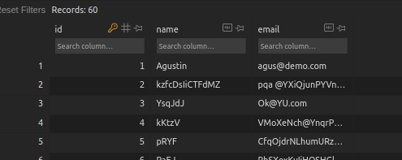
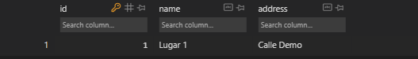

# Django

## 1. Introducción

### Presentación

Profe: Juan José Ruiz
Desarrollo web con python Django

#### Que vamos a aprender?

- Conceptos básicos
- Arquitectura
- Modelar datos
- Hacer consultas
- Hacer templates
- Usar el panel de administración

Que es necesario saber:

- python
- html
- css

### Instalación

#### Requerimientos de software

- python
- pip
- django

#### Comprobamos que django esta instalado

Para ello vamos a crear un proyecto de prueba para comprobar, que se ha instalado correctamente. Usando el comando:

```powershell
django-admin startproject holamundo
```

Si django se ha ejecutado de forma correcta veremos en la carpeta que ejecutamos el comando, que se creo una carpeta con el nombre del proyecto, y una estructura interna de archivos y directorios.

### Patrón de arquitectura

Django es un framework gratuito hecho en python
Un framework es un conjunto de herramientas, librerías y estructura, que nos permite trabajar de forma ágil. A la hora de trabajar en el desarrollo web no es necesario estar inventando la rueda, si no que nos ayudamos de los frameworks para reutilizar herramientas, y desarrollar ágilmente.

En el desarrollo web, hay partes que siempre se repiten, como los son:

- un tablero de control
- servicio de login y autenticación de usuarios
Todas estas acciones son comunes en el desarrollo web.

Ademas django nos facilitara una estructura de arquitectura de nuestra pagina.

#### Patrón MVC


En este modelo lo que tenemos es un usuario, que realiza una petición a una url, es decir esta en el navegador y escribe la dirección de una pagina web.
Entonces lo que ocurre, es que se accede a un diccionario de urls, donde asocia cada una de estas urls a un controlador.
El controlador, es el que sabe lo que tiene que realizar.

Por ejemplo, si uno esta accediendo a un blog, el controlador asociado a esa url, tendrá las funciones esenciales, como pueden ser, consultar los últimos posts, recabar toda la información necesaria.
El controlador llamara a los modelos. El modelo es una abstracción de los datos que tenemos en nuestra base de datos. Y el modelo puede ser tratado como una clase, pudiendo de esta manera abstraerse de la base de datos, que queda en un segundo plano, y utilizar las propiedades definidas de la clase modelo.
El modelo al final, esta conectado a la base de datos y interactúa con ella, mediante un **ORM**(object relational mapping).
Nosotros manipulamos los objetos del modelo, y es el orm quien se encarga de leer, escribir y trabajar con la base de datos.
En el ejemplo, nuestro modelo obtiene los datos  mediante el el orm de la base de datos, y el controlador puede ver los objetos obtenidos por el modelo, y de esa forma el controlador obtiene los datos.
Una vez que el controlador obtiene los datos, lo que hace es pasar esos datos a la vista.
La vista obtiene los datos, y es la que se encarga de mostrar los datos en pantalla.

Los controladores contiene la lógica y la vista tiene las plantillas donde se despliegan los datos.

De esta arquitectura mvc es de donde deriva la arquitectura de django mtv.

#### Patrón de arquitectura MTV

MTV (model template view)
Los mcv son pensados en un principio para componentes más pequeños, y mtv para estructuraras de componentes o aplicaciones mas grandes. por eso django decidió renombrarlas para evitar la polémica.

En esta funciona exactamente igual, solo que a los controladores los vamos a llamar vistas y a las vistas templates/plantillas.


### Estructura de archivos

En la carpeta del proyecto veremos un archivo `manage.py` y una carpeta que es del mismo nombre de un proyecto. Django se divide en aplicaciones, estas serán carpetas.
El archivo `manage.py` es muy importante, pero no es un archivo que nosotros vallamos a modificar, este se encarga de ponernos a disposición la estructura de nuestro proyecto para que podamos desde la terminal trabajar con comandos propios de django. Es el que nos va a permitir gestionar nuestro proyecto.

Es importante recordar que django nos permite gestionar nuestro proyecto de forma modular, por lo tanto podemos tener varias aplicaciones, cada aplicación se gestiona como un paquete.

Ahora de manera de ejemplo vamos a entrar a nuestra aplicación `holamundo`, en nuestro proyecto de prueba `holamundo`, dentro de ella podemos ver la estructura de archivos que nos ha generado django.


Cada una de las aplicaciones debe contener en su directorio un archivo `__init__.py`, para que podamos gestionar cada aplicación como un paquete.
Tenemos  dentro de esta estructura dos archivos que nos van a ayudar con el servidor de pruebas y otro tipo de acciones de pruebas, que estarán `asgi.py` y `wsgi.py`.

Luego tenemos los archivos que si vamos a estar manipulando `settings.py` y `urls.py`.

#### `urls.py`

Este archivo se va encargar de asociar las direcciones url con las vistas/views.
En este archivos tenemos una lista que se llama `urlpatterns`, donde vamos a ir escribiendo todas las urls asociadas a las vistas con las que las vamos a ir controlando.

#### `settings.py`

En este archivo vamos a poner las configuraciones del paquete. Dentro de este archivo hay una lista llamada `INSTALLED_APPS`, donde tendremos las aplicaciones que vienen instaladas por defecto.
También podremos ver los templates, los midwares(aquí encontraremos aps de seguridad.)

También podremos configurar las conexiones con la base de datos y el motor controlador.

##### Installed_apps

- `django.contrib.admin`
Este sirve para establecer un panel de control de administración.
- `django.contrib.auth`
Para gestionar las autenticaciones y los usuarios
- `django.contrib.contenttypes`
Para los diferentes tipos de contenidos
- `django.contrib.sessions`
Para gestionar las sesiones.
- `django.contrib.messages`
Para gestionar los mensajes
- `django.contrib.staticsfiles`
Para controlar la carga de archivos estáticos

### Primer Hola mundo en Django

En el archivo `urls.py`, lo que hacemos es asociar cada una de las rutas de nuestro proyecto con una vista.

Debemos crear nuestro archivo de vistas, para controlar la ruta, y vamos a devolver un mensaje http para comprobar un circuito completo de esta arquitectura.

Lo primero que debemos hacer es entrar a la una consola, en la dirección de nuestro proyecto.
Y vamos a crear la estructura de base de datos necesaria para poder funcionar.
Para eso django lo que tiene que hacer es migrar los modelos de datos que tenemos al sistema de permanencia de datos.
Para ello se utiliza el comando `migrate`.
Este comando se utilizara cada vez que modifiquemos el modelo de la estructura de datos.

De manera de prueba, utilizaremos el motor SQLlite, y luego en un entorno de producción mudaremos a postgre.

Debemos recodar que el archivo `manage.py`, es el que debemos llamar siempre que queramos realizar una acción en nuestro proyecto. Osea que la instrucción sera a través de ese archivo.

```powershell
PS C:\rep\open_boot_camp\django\prueba\holamundo>python manage.py migrate
Operations to perform:
  Applying auth.0004_alter_user_username_opts... OK
  Applying auth.0005_alter_user_last_login_null... OK
  Applying auth.0006_require_contenttypes_0002... OK
  Applying auth.0007_alter_validators_add_error_messages... OK
  Applying auth.0008_alter_user_username_max_length... OK
  Applying auth.0009_alter_user_last_name_max_length... OK
  Applying auth.0010_alter_group_name_max_length... OK
  Applying auth.0011_update_proxy_permissions... OK
  Applying auth.0012_alter_user_first_name_max_length... OK
  Applying sessions.0001_initial... OK
```

> Siempre los comandos deben realizarse desde la ubicación del archivo `manage.py`

Al ejecutar el comando, django debería habernos creado una base de datos.
> La extension para poder ver la base de datos SQLlite, SQLtools SQLlite.

#### Comprobar el proyecto con el servidor de pruebas

Para poder ejecutar el proyecto en el servidor de pruebas, usaremos el comando `python manage.py runserver`.

Al ejecutar el comando debería levantarnos un servidor, y devolver por consola este mensaje:

```powershell
PS C:\rep\open_boot_camp\django\prueba\holamundo> python manage.py runserver

Performing system checks...

System check identified no issues (0 silenced).
December 20, 2022 - 12:00:01
Django version 4.0.4, using settings 'holamundo.settings'
Starting development server at http://127.0.0.1:8000/
Quit the server with CTRL-BREAK.
```

Al hacer click en el enlace ip del servidor, debería abrirnos una pagina en el navegador, si todo salio bien, veremos el siguiente mensaje.


Y para interrumpir la ejecución del servidor debemos apretar `ctrl`+`C`.

#### Ahora vamos a hacer nuestro primer Hola Mundo

Para ello vamos a necesitar un archivo de vistas `views.py`. Que es donde vamos a declarar las vistas con las que vamos a trabajar.

Las vistas son muy sencillas, son las que van a contener la lógica. Mediante una colección de funciones. Es decir dentro de una vista vamos a tener diferentes funciones, y van a estar relacionadas cada una con una url, en el archivos `urls.py`.

```python
# views.py
from django.http import HttpResponse  # Para utilizarla debe ser importada

"""
 Para definir una vista, se utiliza la definición de funciones,
en django, las vistas siempre van a tener al menos un parámetro "request", que es la petición, que recibiremos de nuestra url, la petición de ejecutar esta vista.

El request es importante, ya que si bien en este ejemplo, solo see mostrara un mensaje, el parámetro request podrá devolver información de interés. Como puede ser datos de autenticación, datos de formulario.
"""
def saludo(request):
    return HttpResponse("Hola Mundo")
```

Una vez creada la vista debemos, asociar esa vista a una url.
En el archivo `urls.py`, dentro de la lista `urlpatterns` vamos a crear un nuevo path.

```python
# urls.py

from django.contrib import admin
from django.urls import path
from . import views  # debemos importar el archivo views

urlpatterns = [
    path('admin/', admin.site.urls),
    path('saludo/', views.saludo, name='saludo')  # Y vincular la función con una ruta
]

```

Una vez realizados estos cambios en los archivos, podemos ejecutar nuestro live server y comprobar que en la dirección `ip/saludo/` se muestra el texto indicado en la vista.

## 2. Rutas y plantillas

### Rutas con parámetros

Las rutas con parámetros nos vana permitir, recepcionar variables a través de la url que vamos a poder utilizar en nuestra vista.
Hasta el momento todas las rutas que hemos agregado al proyecto "Hola mundo", son rutas estáticas. No están recibiendo ninguna información de la url.

En django para poder recibir variables a través de la ruta, debemos agregarlas encerradas entre `<>`, e indicar el tipo de variable, dos puntos seguido de su nombre de variable.

```python
# urls.py
from django.contrib import admin
from django.urls import path
from . import views

urlpatterns = [
    path('admin/', admin.site.urls),
    path('saludo/', views.saludo, name='saludo'),
    path('despedida/', views.despedida, name='despedida'),
    path('adulto/<int:edad>/', views.adulto, name='adulto')
]

```

```python
# views.py
from django.http import HttpResponse

def saludo(request):
    return HttpResponse('Hola mundo!')

def despedida(request):
    return HttpResponse('Hasta luego')

def adulto(request, edad):
    if edad >= 18:
        return HttpResponse("Eres mayor de edad")
    else:
        return HttpResponse("No eres mayor de edad")

```

Para probar el funcionamiento de la ruta, debemos ejecutar el live server,
y darle la ruta a nuestra vista seguido de el valor de nuestra variable. En este caso podría ser `ip/adulto/18`, y nos llevara a una pagina que tendrá el mensaje de "Eres mayor de edad".

Esto nos sera muy util a la hora de poder, a través de una ruta a una publicación, una noticia, un producto, construyendo la ruta del objeto que deseamos consultar. Para poder empezar a vincular el contenido de forma mas interactiva.

### Uso de plantillas

> Vamos a crear un nuevo proyecto llamado plantillas

En el caso anterior, osea en el proyecto con el que estuvimos trabajando antes, nos salteamos el paso de MVT, de devolver un plantilla al usuario, como respuesta a un consulta, devolvíamos una respuesta Http simple.
Ahora empezaremos a trabajar para devolver una plantilla al usuario.
Esa plantilla sera una colección de archivo HTML. De esta forma lo que logramos es separar la parte visual de nuestro proyecto de la parte lógica.
La parte lógica se encontrara dentro del archivo views, y la parte visual estará en los templates.
Las plantillas nos servirán también, para estructurar nuestro proyecto, de manera que podamos evitar, el uso de código html repetido.
> concepto: herencia de plantillas

Lo primero que debemos hacer es determinar, cual va ser el directorio donde vamos a poner todas nuestra plantillas(nuestros archivos html), en el archivo settings.py.

Dentro de este archivo veremos que tenemos una lista donde se guardaran los parámetros que mirara django para encontrar las plantillas.

```python
# settings.py

TEMPLATES = [
    {
        'BACKEND': 'django.template.backends.django.DjangoTemplates',
        'DIRS': ['templates'],  # este sera el lugar donde agregaremos el nombre de la carpeta que contendrá nuestras plantillas, ene este caso el nombre sera "templates"
        'APP_DIRS': True,
        'OPTIONS': {
            'context_processors': [
                'django.template.context_processors.debug',
                'django.template.context_processors.request',
                'django.contrib.auth.context_processors.auth',
                'django.contrib.messages.context_processors.messages',
            ],
        },
    },
]
```

Una ves especificado el directorio de las plantillas, vamos a crear un archivo llamado igual que la función `simple`, que le pondremos un `<h1>"Hola mundo"</h1>`.

Luego en el archivo `views.py`, tenemos varias posibilidades con el siguiente paso. Una de ellas es abrir un archivo, renderizarlo, y una vez utilizado cerrarlo. Sin embargo django nos va a facilitar este paso, utilizando un método de la librería *shortcuts* llamado *render*, que nos va a permitir renderizar los templates.

El método `render()` va a necesitar de tres parámetros para funcionar, el primero sera la `request` para que sea consistente, en segundo lugar la dirección del archivo html que sera la plantilla, y un tercero que sera el contexto, en este caso, no tendremos nada, ya que la plantilla que armamos es estática, osea que no necesita de variables o parámetros. Pero en un futuro utilizaremos plantillas que necesitaran parámetros y información para mostrar al usuario lo datos de su consulta.

Un contexto en django, no sera mas que un diccionario, que tendrá llaves y valores.

```python
# views.py
from django.shortcuts import render

def simple(request):
    return render(request, 'simple.html', {})

```

```html
<!-- simple.html -->
<!DOCTYPE html>
<html lang="en">
<head>
    <meta charset="UTF-8">
    <meta http-equiv="X-UA-Compatible" content="IE=edge">
    <meta name="viewport" content="width=device-width, initial-scale=1.0">
    <title>Document</title>
</head>
<body>
    <h1>Hola mundo</h1>
</body>
</html>
```

### Uso de contextos

A lo largo de esta sección se vera como generar plantillas de contexto dinámico.

En este caso a la hora de dar la dirección en el archivo `urls.py`, también debemos dales los valores contextuales, ya que nos estamos refiriendo a una consulta a una plantilla dinámica.

```python
# urls.py
from django.contrib import admin
from django.urls import path
from . import views

urlpatterns = [
    path('admin/', admin.site.urls),
    path('simple/', views.simple, name='simple'),
    path('dinámico/<str=name>', views.dinámico, name='dinámico')
]

```

En el caso de la configuración de la función que describe la vista en el archivo `view.py`, también debemos agregar en los parámetros de la función, los valores que nos darán el comportamiento de la búsqueda que desplegara los datos sobre la plantilla.

```python
# views.py

from django.shortcuts import render

def dinámico(request, name):
    context = {'name' : name}
    return render(request, 'dinámico.html', context)

```

Para utilizar el valor de contexto en la plantilla, debemos usar dobles llaves, y escribir el nombre de la llave del diccionario, descrito en el archivo `views.py`.

```html
<!DOCTYPE html>
<html lang="en">
<head>
    <meta charset="UTF-8">
    <meta http-equiv="X-UA-Compatible" content="IE=edge">
    <meta name="viewport" content="width=device-width, initial-scale=1.0">
    <title>Document</title>
</head>
<body>
    <h1>Hola {{name}}</h1>
</body>
</html>
```


En el contexto que le pasamos a la plantilla, no solo podemos pasarle nombres de llaves, sino también le podemos pasar objetos, y sus variables y métodos asociados.

### Bucles y condicionales en plantillas

En esta sección vamos a ver como recorrer estructuras de datos, para completar nuestras plantillas.

Como principio de la arquitectura, es fundamental no delegar partes de la lógica a la plantilla, como tampoco asi delegar partes del estilo visual al la vista.

Para recorrer estructuras de datos, para visualizar esos datos( osea, que no son lógicas de comportamiento), podemos incluir en el archivo html, código en nomenclatura python.

```html
<!DOCTYPE html>
<html lang="en">
<head>
    <meta charset="UTF-8">
    <meta http-equiv="X-UA-Compatible" content="IE=edge">
    <meta name="viewport" content="width=device-width, initial-scale=1.0">
    <title>Document</title>
</head>
<body>
    <h1>Hola {{name}}</h1>
    <h3>Categorías</h3>
    <ul>
        
            <li>{{ category }}</li>
        
    </ul>
</body>
</html>
```

Teniendo en cuenta, que categories es una lista que definimos en la vista.

```python
from django.shortcuts import render

def dinámico(request, name):
    categories = ['code', 'design', 'marketing']
    context = {'name': name, 'categories' : categories}
    return render(request, 'dinámico.html', context)

```

El resultado de dicha configuración es la siguiente:


Si quisiéramos destacar un valor, en caso de que se encuentre dentro del contexto que le pasamos a la plantilla, podremos agregar un `if`

```html
<!DOCTYPE html>
<html lang="en">
<head>
    <meta charset="UTF-8">
    <meta http-equiv="X-UA-Compatible" content="IE=edge">
    <meta name="viewport" content="width=device-width, initial-scale=1.0">
    <title>Document</title>
</head>
<body>
    <h1>Hola {{name}}</h1>
    <h3>Categorías</h3>
    <ul>
        
            
                <li><b>{{category}}</b></li>
            
                <li>{{ category }}</li>
            
        
    </ul>
</body>
</html>
```

Esta plantilla, se comportara de esta manera:


Como podemos observar, que la palabra `code` esta en negrita, y las otras no.

### Comentarios y filtros

En esta sección vamos a ver cosas útiles para la hora de trabajar sobre las plantillas, como son los comentarios y los filtros.

#### Comentarios

Los comentarios html, son visibles cuando uno inspecciona la pagina desde el navegador, pero ahora veremos comentarios que no serán visibles, ya que django no los renderizará en el navegador.

```html
<!DOCTYPE html>
<html lang="en">
<head>
    <meta charset="UTF-8">
    <meta http-equiv="X-UA-Compatible" content="IE=edge">
    <meta name="viewport" content="width=device-width, initial-scale=1.0">
    <title>Document</title>
</head>
<body>
    
    Esto es un comentario multilinea 
    fsdffsdfs
    
    <h1>Hola {{name}}</h1>
    <h3>Categorías</h3>
    <ul>
        {# Este es un comentario simple o de una sola linea #}
        
            
                <li><b>{{category}}</b></li>
            
                <li>{{ category }}</li>
            
        
    </ul>
</body>
</html>
```

#### Filtros

Supongamos que quiero con el ejemplo anterior, poner luego de la renderización de los objetos de la lista `categories`, el total de elementos. Esto podría realizarlo creando una nueva variable, en el archivo `views.py` donde se almacene el largo de la lista, o también lo puedo hacer utilizando un filtro en la plantilla.

Para el uso de filtros se utiliza la siguiente sintaxis, dentro de las dobles llaves ponemos el nombre de variable, seguido por el símbolo pipe o tubería `|`, continuado por el nombre del filtro que le deseamos aplicar. En este caso `length`. Esta construcción sintáctica tomara una forma así`{{categories|length}}`

```html
<!DOCTYPE html>
<html lang="en">
<head>
    <meta charset="UTF-8">
    <meta http-equiv="X-UA-Compatible" content="IE=edge">
    <meta name="viewport" content="width=device-width, initial-scale=1.0">
    <title>Document</title>
</head>
<body>
    
    Esto es un comentario multilinea 
    fsdffsdfs
    
    <h1>Hola {{name}}</h1>
    <h3>Categorías</h3>
    <ul>
        {# este es un comentario simple o de una línea #}
        
            
                <li><b>{{category}}</b></li>
            
                <li>{{ category }}</li>
            
        
    </ul>
    <h5>Total de categorías: {{ categories|length }}</h5>
</body>
</html>
```

El resultado sera el siguiente:


Completar con todos los filtros en Django desde la documentación oficial.

### Archivos estáticos

Creamos un nuevo proyecto con el comando `django-admin startproject estáticos`

Vamos a realizar la migración principal del sistema, entrando en el directorio del proyecto, vamos ejecutar el comando `python manage.py migrate`

Vamos a repetir todo el circuito para agregar una plantilla.

Hasta ahora todo los contenidos que hemos estado creando se ha basado en etiquetas, pero en el desarrollo de una pagina vamos a necesitar varios tipos de contenidos, como pueden ser imágenes, archivos css, o archivos java script, estos son llamados archivos estáticos.

Como se realiza la importación de archivos estáticos en una plantilla?

Lo primero es ir al archivo `settings.py`, y en la variable `STATIC_URL`, y ver que ruta tiene especificada.

Por defecto la ruta que viene, es `'static/'`, osea el directorio **static** en la raíz del proyecto.

y debemos agregar las siguientes lineas en el archivo:

```python
# settings.py

STATICFILES_DIRS = [
    BASE_DIR / "static",
    '/var/www/static',
]
```

En la plantilla debemos agregar esta configuración:

```html
 <!-- esto debemos agregar -->
<!DOCTYPE html>
<html lang="en">
<head>
    <meta charset="UTF-8">
    <meta http-equiv="X-UA-Compatible" content="IE=edge">
    <meta name="viewport" content="width=device-width, initial-scale=1.0">
    <link rel="stylesheet" href="">  <!-- esto también -->
    <title>Document</title>
</head>
<body>
    <h1>Estáticos</h1>
</body>
</html>
```

Después crearemos un archivo css dentro de la carpeta static.

```css
h1 {
    font-size: 50px;
    color: red;
}
```

Podemos ver que el resultado de nuestra pagina tiene los estilos especificados en el archivo `css`.


### Herencia de plantillas

En esta sección, vamos a trabajar con otro proyecto django llamado `herencia`.

El concepto de herencia se aplica para, mejorar la estructura de nuestro proyecto y no caer en el error de repetir muchas veces la misma estructura de plantilla.

Por ejemplo, en el siguiente caso tenemos tres views, que llaman a tres plantillas diferentes, y si miramos las plantillas son idénticas una a otra.

```python
# views.py
from django.shortcuts import render

def herencia(request):
    return render(request, 'herencia.html', {})

def ejemplo(request):
    return render(request, 'ejemplo.html', {})

def otra(request):
    return render(request, 'otra.html', {})
```

```html
<!-- herencia.html -->
<!DOCTYPE html>
<html lang="en">
<head>
    <meta charset="UTF-8">
    <meta http-equiv="X-UA-Compatible" content="IE=edge">
    <meta name="viewport" content="width=device-width, initial-scale=1.0">
    <title>Document</title>
</head>
<body>
    <h1>Herencia</h1>
</body>
</html>
```

```html
<!-- ejemplo.html -->
<!DOCTYPE html>
<html lang="en">
<head>
    <meta charset="UTF-8">
    <meta http-equiv="X-UA-Compatible" content="IE=edge">
    <meta name="viewport" content="width=device-width, initial-scale=1.0">
    <title>Document</title>
</head>
<body>
    <h1>Ejemplo</h1>
</body>
</html>
```

```html
<!-- otra.html -->
<!DOCTYPE html>
<html lang="en">
<head>
    <meta charset="UTF-8">
    <meta http-equiv="X-UA-Compatible" content="IE=edge">
    <meta name="viewport" content="width=device-width, initial-scale=1.0">
    <title>Document</title>
</head>
<body>
    <h1>Otra</h1>
</body>
</html>
```

Como podemos ver, estamos repitiendo la misma estructura, al realizar el plantillado.

Ahora veremos como vamos a armar el plantillado para poder heredar, las partes de la plantilla que se repite en todas las paginas.
Para eso vamos a utilizar un archivo llamado `base.html` en un sub directorio llamado `layouts` de la carpeta `templates`.

En este archivo lo que haremos es dejar especificados diferentes bloques, que serán utilizados por las diferentes sub plantillas, por ejemplo, tendremos un bloque `content` en el main, este bloque lo utilizaran todas las paginas, por que sera donde se desplegara el contenido. Pero después hay paginas que pueden requerir, un estilo especial, entonces dejamos un bloque llamado `styles`, para que dichas paginas puedan hacer uso de él.

El bloque `title`, también sera utilizado por todas, al igual que `content`. Y luego del body podemos dejar un bloque para que aquellas paginas que necesiten importar un archivo script, puedan hacerlo.

Por asi decirlo, dejando estos, bloques dejamos los lugares donde es posible que nuestras sub plantillas se diferencien de la base.

```html
<!-- base.html -->

<!DOCTYPE html>
<html lang="en">
<head>
    <meta charset="UTF-8">
    <meta http-equiv="X-UA-Compatible" content="IE=edge">
    <meta name="viewport" content="width=device-width, initial-scale=1.0">
    <link rel="stylesheet" href="">
    
    <title></title>
</head>
<body>
    <nav>
        <ul>
            <li><a href="#">Herencia</a></li>
            <li><a href="#">Ejemplo</a></li>
            <li><a href="#">Otra</a></li>
        </ul>
    </nav>
    <main>
        
    </main>
    <footer>
        <p>Todos los derechos reservados</p>
    </footer>
    
</body>
</html>
```

También configuramos un archivo css, básico como para darle un estructura visual simple a las paginas.

```css
/* style.css */
* {
    padding: 0;
    margin: 0;
    box-sizing: border-box;
}

nav {
    background-color: #666;
}

ul {
    list-style-type: none;
    display: flex;
    justify-content: center;
    align-content: center;
}

ul li{
    padding:  20px;
}

ul li a{
    text-decoration: none;
    font-size: 20px;
    color: white;
}

main {
    display: flex;
    justify-content: center;
    align-items: center;
    padding: 20px;
    min-height: 75vh;
}

footer {
    background-color: #666;
    color: white;
    display: flex;
    justify-content: center;
    align-items: center;
    width: 100%;
    padding: 50px;
}
```

Luego, para indicar en las plantillas `herencia.html`, `ejemplo.html` y `otra.html`, heredan de la plantilla `base.html`, se utilizara un bloque de código django en las plantillas.

```html
<!-- herencia.html -->


```

```html
<!-- ejemplo.html -->


```

```html
<!-- otra.html -->


```

De esta manera ya indicamos en las sub plantillas que extenderemos la plantilla base, tal cual como se extiende una clase.

Pero nos falta, por si decirlo, implementar los bloques que han quedado vacíos en la plantilla base.

Vamos a empezar con el la plantilla `herencia.html`

```html
<!-- herencia.html -->


Herencia


    <h1>Herencia</h1>

```

Como se puede ver, los bloques `styles` y `scripts`, no los estoy usando, eso es por que implemento solo aquellos bloques que necesito para esta sub plantilla, el resto no son relevantes en este caso.

Lo que nos permite eso no solo es, reducir la cantidad de repeticiones en las plantillas, si no que en el caso de necesitar agregar algo en nuestra pagina, solo deberemos agregarla a la plantilla base. Por ejemplo, si en esta quisiéramos agregar el nombre de la empresa en el menu de navegación, simple mente sería agregar una linea, a dicho archivo, sin tener que controlar cuestiones de consistencia estética entre las diferentes paginas de nuestro proyecto.

### Enlace e inclusión

En esta sección vamos a estar trabajando sobre el mismo proyecto que en la sección anterior. Lo primero que vamos a hacer es agregar un path para la ruta raíz.

```python
# urls.py
from django.contrib import admin
from django.urls import path
from . import views

urlpatterns = [
    path('admin/', admin.site.urls),
    path('herencia/', views.herencia, name='herencia'),
    path('ejemplo/', views.ejemplo, name='ejemplo'),
    path('otra/', views.otra, name='otra'),
    path('', views.index, name='index')  # path para la ruta raíz
]
```

Luego en las vistas vamos a definir la vista de `index`.

```python
# views.py
from django.shortcuts import render

def index(request):
    return render(request, 'index.html', {})

def herencia(request):
    return render(request, 'herencia.html', {})

def ejemplo(request):
    return render(request, 'ejemplo.html', {})

def otra(request):
    return render(request, 'otra.html', {})
```

Ahora vamos a continuar viendo como se hacen las vinculaciones entre las distintas vistas/plantillas, ya que hasta ahora hemos venido trabajando con la barra de direcciones, y de esa manera nos hemos estado moviendo por nuestros proyectos.

Para ello vamos a trabajar sobre el archivo `base.html`, que es el archivo que tiene el menu de enlaces. Y lo que haremos es darle la dirección a cada uno de los enlaces que tiene el menu de navegación.

Y para darle esta dirección al enlace, utilizaremos el nombre que hemos estado poniéndole en la configuración de las urls, ya que esto presenta una ventaja, por que si en un momento tuviésemos la necesidad de cambiar las rutas de los urls, tendríamos que alterar también los enlaces referidos a ellas. Sin embargo al trabajar con los nombres no tendremos esos problemas.

Al agregar los nombres de las direcciones, utilizaremos un comando de django, con las llaves y los símbolos de porcentaje, utilizando la palabra `url` y seguido por el nombre entre comillas de la dirección.

```html
<!-- base.html -->

<!DOCTYPE html>
<html lang="en">
<head>
    <meta charset="UTF-8">
    <meta http-equiv="X-UA-Compatible" content="IE=edge">
    <meta name="viewport" content="width=device-width, initial-scale=1.0">
    <link rel="stylesheet" href="">
    
    <title></title>
</head>
<body>
    <nav>
        <ul>
            <!-- Aquí es donde agregaremos los nombres, de las
             direcciones, utilizando un comando de django -->
            <li><a href="">Herencia</a></li>
            <li><a href="">Ejemplo</a></li>
            <li><a href="">Otra</a></li>
        </ul>
    </nav>
    <main>
        
    </main>
    <footer>
        <p>Todos los derechos reservados</p>
    </footer>
    
</body>
</html>
```

En el caso de nuestra plantilla base, hay posibilidades, de seguir atomizando aun mas el código, y hacerlo más legible y mejor optimizado, para ello vamos a hacer uso de los `includes`(inclusión).

Para ello, vamos a crear una carpeta dentro de `templates/layouts` que se llame `partials`. Y dentro de ella vamos a crear un archivo html que se llame `menu`. Ahora en vez de tener el menu en la plantilla base, vamos a extraerlo y dejarlo en el archivo `menu.html` a toda la etiqueta `<nav>`.
Y luego lo que haremos será agregar en el archivo `base.html`, y para ello, com estamos en el archivo base, lo que hacemos no es utilizar la herencia de plantilla, si no es la inclusión de contenido html. Que es otro concepto de django.

```html
<!-- menu.html -->
<nav>
    <ul>
        <li><a href="">Home</a></li>
        <li><a href="">Herencia</a></li>
        <li><a href="">Ejemplo</a></li>
        <li><a href="">Otra</a></li>
    </ul>
</nav>
```

```html
<!-- base.html -->

<!DOCTYPE html>
<html lang="en">
<head>
    <meta charset="UTF-8">
    <meta http-equiv="X-UA-Compatible" content="IE=edge">
    <meta name="viewport" content="width=device-width, initial-scale=1.0">
    <link rel="stylesheet" href="">
    
    <title></title>
</head>
<body>
    
    <main>
        
    </main>
    <footer>
        <p>Todos los derechos reservados</p>
    </footer>
    
</body>
</html>
```

De esta manera, podemos modularizar un poco mas nuestro plantillado.

Por ejemplo, otro caso donde podríamos seguir modularizando es en el caso del footer, osea que dentro de la carpeta partials, podríamos agregar un archivo `footer.html`

```html
<!-- base.html -->

<!DOCTYPE html>
<html lang="en">
<head>
    <meta charset="UTF-8">
    <meta http-equiv="X-UA-Compatible" content="IE=edge">
    <meta name="viewport" content="width=device-width, initial-scale=1.0">
    <link rel="stylesheet" href="">
    
    <title></title>
</head>
<body>
    
    <main>
        
    </main>
    
    
</body>
</html>
```

Y de esta manera seguir atomizando un poco mas nuestro proyecto. Esto es importante en la medida de lo posible, ir atomizando, nuestro código para hacerlo mas manejable y mas fácil de leer.

### Documentación oficial

En esta sección, vamos a explorar la documentación de django, para entender como navegar la en caso de tener alguna duda o un problema, que nos sea util.

### Practica de plantillas

El objetivo de esta practica es muy sencillo, vamos a hacer una pagina con dos urls, en una sección inicial, que va ocupar el directorio raíz, vamos a tener una imagen nuestra con info, y en una segunda sección vamos listar un conjunto de imágenes que harán las veces de nuestro porfolio.

## 3. Vistas y modelos

### Modularización

En esta sección vamos a ver el concepto de modularización.

Gracias al concepto de modularización vamos a poder reciclar, gran parte de nuestros proyectos en django, no solo la parte del frontal y las plantillas, si no también en la parte de las aplicaciones y el backend.

Para poder entender esto, vamos a profundizar aún más en la arquitectura de django.

Hasta ahora los proyectos que venimos desarrollando, hemos estado trabajando en la aplicación principal de nuestros proyectos.

Pero debemos entender que el el desarrollo de nuestros proyectos en django, van a estar conformadas por mas de una aplicación.

Y para cumplir con el propósito de que nuestros proyectos sean modulares, tenemos que pensar muy bien cuales serán las acciones que nuestro proyecto debe realizar y cumplir, y para poder llevar a adelante un buen diseño de aplicaciones que se encarguen de cumplir las metas de esas acciones de nuestro proyecto.

Para entender de mejor manera esto, vamos a ver un ejemplo:

Supongamos que tenemos que desarrollar el proyecto de un portal de noticias, para ello, tenemos que cumplir con ciertas tareas que serán necesarias para que este cuente con la funcionalidades requeridas.

En este ejemplo podríamos tener las siguientes aplicaciones:

- Gestor de post (publicaciones)
- Login social, con un gestor de sesiones
- Un gestor de comentarios en las publicaciones
- Gestor de anuncios
- Gestionar el compartir en redes sociales.


Entonces a la hora de encarar un proyecto con muchas funciones, en ves de que una sola aplicación tenga programada la lógica de todas estas características, vamos a partir el desarrollo de las características en diferentes aplicaciones. Para que a la hora de abordar el desarrollo, no terminemos con un código espagueti, y una aplicación que si falla perdemos todas las funcionalidades de nuestro proyecto.

Y supongamos ahora que tenemos que desarrollar un proyecto de un periódico digital, en este tendremos una aplicación de gestor de suscripciones, otra de los feed, y otra en la que se le ofrece al usuario una ventanilla de pagos. Pero también seguramente necesitaremos un gestor de sesiones, entonces, si nosotros en el proyecto anterior, ya habíamos desarrollado esa funcionalidad en una aplicación modular, tranquilamente podemos incorporarla en este nuevo proyecto de forma sencilla.

Para poder lograr este proceso de forma solida, las aplicaciones deben ser auto suficientes, esto quiere decir que deben tener su modelo de datos, su base de datos, sus vistas y plantillas donde se muestren los datos, todo de forma integrada. Entonces a la hora de reciclar una aplicación será, una tarea muy sencilla y practica.

Y solo deberemos ocuparnos de integrar la estética del modulo que estamos importando.

#### Práctica

Ahora haremos un proyecto de practica, donde crearemos mas de una aplicación.
Creamos un nuevo proyecto llamado modularización. Y una segunda aplicación llamada comentarios.

```powershell
> django-admin startproject modularización
> cd .\modularización\
> python manage.py startapp comentarios
```


Podemos ver en la arquitectura del modulo que hemos creado, que este ya cuenta con su propia estructura. Y que esta consiste por partes ya conocidas, y otras nuevas.

Para agregar correctamente la aplicación en nuestro proyecto, debemos incluirla en la lista de `INSTALLED_APPS`  del archivo `settings.py`. Como habita en la raíz del proyecto, podemos agregarla directamente en, con el nombre del directorio que la contiene, en este caso `comentarios`.

Se puede usar el comando `check` para confirmar que la aplicación esta configurada correctamente.

```powershell
> python manage.py check comentarios
System check identified no issues (0 silenced).
```

### Modelos de datos

Para crear un modelo de datos en django, en vez de crear tablas, sus campos y relaciones, vamos a crear clases en lenguaje python. Y a la hora e crear registros, estaremos creado objetos a partir de las clases. Entonces el orm de django, por cada clase que creemos, creara una tabla. Donde cada atributo de nuestra clase sera una columna en una tabla.

De esta manera django nos permite migrar de un lenguaje de base de datos a otro, ya que la estructura de clases es igual, y django se encarga de la comunicación con el servidor de base de datos. Para ello solo debemos cambiar la configuración del motor de base de datos en el archivo `settings.py`.

Para practicar este concepto de modelación de datos, vamos a usar el proyecto "modularización".

Los modelos de datos, se escriben dentro de el archivo `models.py` de las aplicaciones secundarias de un proyecto. Utilizaremos la aplicación comentarios para crear nuestro primer modelo.

```python
# models.py
from django.db import models

# Create your models here.
```

Podemos ver que, ya por defecto, django nos importa de la librería de bases de datos `models`, esto es por que sera la clase que vamos a extender al crear nuestros modelos.

Una primera modelación para nuestros comentarios podría ser:

```python
# models.py
from django.db import models

class comments(models.Model):

    name = models.CharField(max_length=50, null=False)
    score = models.IntegerField(default=3)
    comment = models.TextField(max_length=1000, null=True)

    def __str__(self):
        return self.name

```

Creamos una clase `comments`, que tiene los atributos de `name` que es un `CharField` que tiene un máximo de caracteres de 50 y que no puede ser nulo, otro atributo es la puntuación `score` que por defecto si no se especifica es 3, y por ultimo el contenido del comentario como `comment` que puede ser nulo y que tiene un máximo de caracteres de 1000

Para el siguiente paso debemos usar el comando `makemigrations`, que se usaba cuando creamos el proyecto para que se ejecuten las migraciones de iniciación, y cada vez que cambiemos nuestro modelo de datos, debemos volver a ejecutarlo.

```powershell
PS C:\rep\open_boot_camp\django\prueba\modularizacion> python manage.py makemigrations
Migrations for 'comentarios':
  comentarios\migrations\0001_initial.py
    - Create model comments
```

Este comando creara un archivo de migración inicial, donde se crearan las migraciones para el modelo de la aplicación comentarios.

Una vez creada la migración, nos queda ejecutarla con el comando `migrate`.

```powershell
PS C:\rep\open_boot_camp\django\prueba\modularizacion> python manage.py migrate
Operations to perform:
  Apply all migrations: admin, auth, comentarios, contenttypes, sessions
Running migrations:
  Applying contenttypes.0001_initial... OK
  Applying auth.0001_initial... OK
  Applying admin.0001_initial... OK
  Applying admin.0002_logentry_remove_auto_add... OK
  Applying admin.0003_logentry_add_action_flag_choices... OK 
  Applying contenttypes.0002_remove_content_type_name... OK  
  Applying auth.0002_alter_permission_name_max_length... OK  
  Applying auth.0003_alter_user_email_max_length... OK
  Applying auth.0004_alter_user_username_opts... OK
  Applying auth.0005_alter_user_last_login_null... OK
  Applying auth.0006_require_contenttypes_0002... OK
  Applying auth.0007_alter_validators_add_error_messages... OK
  Applying auth.0008_alter_user_username_max_length... OK    
  Applying auth.0009_alter_user_last_name_max_length... OK   
  Applying auth.0010_alter_group_name_max_length... OK
  Applying auth.0011_update_proxy_permissions... OK
  Applying auth.0012_alter_user_first_name_max_length... OK  
  Applying comentarios.0001_initial... OK
  Applying sessions.0001_initial... OK
```

Como podemos ver en la base de datos, se ha ejecutado correctamente el comando de migración, creando una tabla llamada `comentarios_comments`. Al crear una clase sin especificar nada sobre el atributo id, django creara ese campo por defecto.


#### Modificación de un modelo de datos

En el caso que deseáramos modificar un modelo de datos, lo haremos directamente en el archivo models.py de la aplicación. Una vez realizada la modificación crearemos la migración (django detectara el cambio) con el comando `python3 manage.py makemigrations` y luego ejecutaremos la migración con el comando `python3 manage.py migrate`.

```python
# models.py
from django.db import models

class comments(models.Model):

    name = models.CharField(max_length=50, null=False)
    score = models.IntegerField(default=3)
    comment = models.TextField(max_length=1000, null=True)
    date = models.DateField(null=True)
    

    def __str__(self):
        return self.name
```


#### En caso de modificación sin valor default

Como vemos en la modificación anterior, se especifica que el valor date, puede ser nulo, hay que tener en cuenta esto, ya que como la base de datos puede contener datos ya, quiere decir que se agregan campos a filas ya existentes. Estas si no tienen permitido tener un valor nulo, en la definición del nuevo campo, generara un error al hacer el plan de migración, ya que django se dará cuenta del error. Este error interrumpirá la creación del plan de  migración, y nos dará dos opciones, proveer un valor por default en el momento, desde la terminal o cancelar la creación del plan de migración y darle un valor por default al campo desde el archivo de modelos, o permitir que tenga valor nulo.

#### Planes de migración

Para entender mejor, que es lo que hace django cuando modificamos el modelo de datos y le pedimos que haga un plan de migración para esas modificaciones, vamos a observar, los archivos `.py` que crea en la carpeta migrations.

```python
# 0002_comments_date.py
# Generated by Django 3.2.12 on 2023-03-02 21:28

from django.db import migrations, models


class Migration(migrations.Migration):

    dependencies = [
        ('comentarios', '0001_initial'),
    ]

    operations = [
        migrations.AddField(
            model_name='comments',
            name='date',
            field=models.DateField(null=True),
        ),
    ]
```

Aca vemos las acciones que django se dio cuenta que debía hacer para poder agregar a nuestra tabla de comentarios el campo de la fecha que le habíamos especificado en el modelo de datos.

Estas migraciones van generando un historial, que nos permite volver atrás en la estructura de datos.

### Delegación de rutas

En esta parte del desarrollo vamos a ver como conectar, nuestro proyecto general a el contenido de las aplicaciones. Con el objetivo de luego poder trabajar con los modelos de las aplicaciones.

Vamos a comenzar creado un fichero `urls.py` dentro de nuestra aplicación, en este caso seguiremos trabajando con el proyecto `modularizacion`, y conectaremos la aplicación `comentarios`.

Vamos a trabajar en la aplicación, como anteriormente trabajamos sobre el proyecto, es decir configuraremos las urls y las vistas de la aplicación, como si fuese un proyecto.

Copiamos la estructura del archivo `urls.py` de nuestro proyecto general y la pegamos en el nuevo `urls.py` de la aplicación comentarios.

Para empezar vamos solamente a configurar un `hola mundo`

```python
# urls.py

from django.contrib import admin
from django.urls import path
from . import views

urlpatterns = [
    path('test/', views.test, name='test')
]

```

```python
# views.py

from django.shortcuts import render
from django.http import HttpResponse

def test(request):
    return HttpResponse("Funciona correctamente")

```

Todo esto esta configuración esta dentro de nuestra aplicación, lo que quiere decir es que si nosotros corremos el live server, no podremos acceder a esta vista a través de la url que acabamos de configurar.
Por que el proyecto general esta gobernado por la configuración que tiene dentro de `modularizacion`, y si vemos el archivo `urls.py` de este, no tenemos todavía acceso a lo que ocurre dentro de la aplicación `comentarios`.

```python
# urls.py (modularizacion)
from django.contrib import admin
from django.urls import path
from django.urls import include

urlpatterns = [
    path('admin/', admin.site.urls),
    path('comentarios/', include('comentarios.urls'))
]

```

Como se ve en arriba, utilizamos la función include, que debimos importarla. Des esta manera integramos a nuestro proyecto todas las urls que ese encuentran el el archivo `urls.py` de nuestra aplicación comentarios. Para acceder a estas debemos darle la dirección, precedida del nombre de la aplicación a la que pertenece. Por ejemplo: `http://127.0.0.1:8000/comentarios/test/`


Con el objetivo de dejar las configurado para el próximo tema, creamos una vista simple llamada create, para abordar luego CRUD, la completamos con un
HttpResponse, y le dejamos configurada una url con el nombre create.

### Creación y borrado de datos

En esta sección seguiremos utilizando el proyecto de modularizacion. Una cuestión a tener en cuenta, que pasamos por alto, es que en la construcción de los modelos utilizamos el nombre "comments" pero los modelos por convención siempre deben ir con la primera letra en mayúsculas y en singular "Comment".

Lo normal a la hora de crear un modelo, seria crear un formulario para poder ingresar datos a ese modelo, sin embargo todavía no hemos llegado a esa parte, y por ahora agregaremos datos desde la vista. Entonces cuando accedamos a la ruta vamos a crear un dato automáticamente, esto no es un comportamiento usual ni recomendable. Pero nos servirá para ver como se crean dichos objetos.

#### Creamos un comentario desde views

Para crear un objeto, tenemos que importar a nuestro archivo `views.py` la clase `Comment` del archivo `models.py`.

Como podemos observar desde la configuración de nuestro modelo, sabemos los datos que se deben aportar para crear un comentario.

```python
from django.db import models

class Comment(models.Model):

    name = models.CharField(max_length=50, null=False)
    score = models.IntegerField(default=3)
    comment = models.TextField(max_length=1000, null=True)
    date = models.DateField(null=True)
    signature = models.CharField(max_length=100, default="Firma")

    def __str__(self):
        return self.name
```

Debemos darle un nombre, ya que este no puede ser nulo. Los demás valores de nuestro dato, pueden ser nulos. Ya que el `score` tiene un valor por defecto, `comment` puede ser nulo, también `date` y `signature` tiene un valor por defecto.

Para crear este dato, vamos a crear un objeto, llamando a la clase `Comment` y le pasaremos como argumentos name="Agus", score=5, comment="Este es un comentario".
Y luego para generar la acción de guardado, vamos a utilizar la función `save()`, como función de nuestro objeto. Esto le indicara a django que pase estos argumentos del objeto a la base de datos.

```python
# views.py
from django.shortcuts import render
from django.http import HttpResponse
from .models import Comment

def test(request):
    return HttpResponse("Funciona correctamente")

def create(request):
    comment = Comment(name="Agus", score=5, comment="Este es un comentario.")
    comment.save()
    return HttpResponse("Ruta para probar la creación de modelos")
```

Al recargar la pagina `comentarios/create/` debería haber ejecutado estas acciones y se deberá ver reflejadas en la base de datos.


##### Otra forma de crear un registro

Esta no es la única forma de crear un registro, vamos a ver otro ejemplo, de como hacerlo.

```python
# views.py
from django.shortcuts import render
from django.http import HttpResponse
from .models import Comment

def test(request):
    return HttpResponse("Funciona correctamente")

def create(request):
    comment = Comment.objects.create(name="Nicolas")
    return HttpResponse("Ruta para probar la creación de modelos")
```

De esta forma, se guardara por defecto, gracias a la función create, dentro de objects.


Podemos observar que django nos abstrae de tener que utilizar instrucciones sql, y nos deja con las herramientas de lógica que se explicitan en las vistas y utilizamos los objetos que preparamos de ante mano en los modelos.

#### Eliminar un dato

Para ello crearemos una vista nueva, con su respectiva url.

Los siguiente sera encontrar el registro que deseamos eliminar de de nuestra base de datos, para ello vamos a crear un objeto, y a este le asignaremos el registro/dato que vamos a eliminar.

```python
# views.py

from django.shortcuts import render
from django.http import HttpResponse
from .models import Comment

def delete(request):
    comment = Comment.objects.get(id=1)
    comment.delete()
    return HttpResponse("Ruta para la eliminación de registros")
```

Podemos ver que utilizamos la función get, y le entregamos el valor de id, de registro, y luego eliminamos el registro asignado a ese objeto.


##### Otra forma de borrado

Esta consiste en utilizar las funciones objects

```python
# views.py
from django.shortcuts import render
from django.http import HttpResponse
from .models import Comment

def delete(request):
    Comment.objects.filter(id=2).delete()
    return HttpResponse("Ruta para la eliminación de registros")
```


### Estructuras y claves foráneas

Para poner en practica estos conocimientos, vamos a crear un nuevo proyecto llamado `my_blog`, en este vamos a crear una aplicación llamada `post`.
> Y también realizaremos las configuraciones para una correcta modularizacion, configurando los archivos urls.

Creamos los modelos de la aplicación post:

```python
from django.db import models
from datetime import date

class Author(models.Model):
    name = models.CharField(max_length=200)
    email = models.EmailField()

    def __str__(self):
        return self.name
    
class Entry(models.Model):
    headline = models.CharField(max_length=255)
    body_text = models.TextField()
    public_date = models.DateField(default=date.today)
    rating = models.IntegerField(default=5)

    def __str__(self):
        return self.headline

```

Ahora vamos a introducir un concepto nuevo en el modelado de datos, hasta ahora habíamos creado modelos independientes, lo que quiere decir que los modelos no tenían relación entre ellos, osea no eran interdependientes.

La parte mas interesante de hacer modelado de datos, es poder relacionarlos entre si.

Esto podemos hacerlo desde las claves foráneas. Estas nos permiten relacionar los registros de una tabla a los contenidos de otra tabla.

Refiriendo un valor que contiene una clave foránea, a la clave primaria de otra tabla.

En django se emplean las claves foraneas agregando un valor que va a contener dentro del modelo la relación a los registros de otro modelo.

```python
from django.db import models
from datetime import date

class Author(models.Model):
    name = models.CharField(max_length=200)
    email = models.EmailField()

    def __str__(self):
        return self.name
    
class Entry(models.Model):
    author = models.ForeignKey(Author)  # Esta es la clave foránea que apunta a el id del modelo author
    headline = models.CharField(max_length=255)
    body_text = models.TextField()
    public_date = models.DateField(default=date.today)
    rating = models.IntegerField(default=5)

    def __str__(self):
        return self.headline
```

#### Que sucede si un registro tiene una clave foránea que apunta a un registro que ha si do eliminado?

Para poder adelantarnos a este inconveniente, se puede en la configuración de la clave foránea darle instrucciones de que hacen en este supuesto error.

```python
from django.db import models
from datetime import date

class Author(models.Model):
    name = models.CharField(max_length=200)
    email = models.EmailField()

    def __str__(self):
        return self.name
    
class Entry(models.Model):
    author = models.ForeignKey(Author, on_delete=models.CASCADE)
    headline = models.CharField(max_length=255)
    body_text = models.TextField()
    public_date = models.DateField(default=date.today)
    rating = models.IntegerField(default=5)

    def __str__(self):
        return self.headline

```

La variable que se ocupa de este incidente, es `on_delete=`.
Y en este caso utilizamos la configuración `models.CASCADE`. Que eliminara en forma de cascada los registros `Entry` que apuntaban en este caso a el autor que fue eliminado.

Siempre que utilicemos claves foráneas es muy importante, especificar las acciones al menos en el borrado, y si es posible también en el actualizado de datos.

### Seeding y paquetes

Ahora vamos a poblar nuestra base de datos para hacer pruebas con esta. Para realizar esta tarea vamos a utilizar un faker factory. Que nos permitirá ingresar datos falsos en la base de datos y poder realizar acciones sobre ella.

Esta es una aplicación que no viene por defecto integrada en las aplicaciones django, por lo que también nos servirá de ejemplo de las instalaciones de paquetes en un proyecto.

Para realizar la instalación vamos de esta aplicación, entramos en su pagina de github <https://github.com/Brobin/django-seed>.

Esta nos dice que debemos utilizar el comando `pip install django-seed`, y luego debemos agregar en la lista `INSTALLED_APPS` del archivo `settings.py` el nombre de la aplicación, `django_seed`. Para comprobar si hemos hecho bien la instalación, utilizaremos el comando `python manage.py check django_seed`.

También debemos instalar manualmente una dependencia de este modulo, que se llama `psycopg2`, utilizando el comando `pip install psycopg2-binary`.

#### Poblar una base de datos

Para utilizar el modulo `django_seed`, usaremos el comando `python manage.py seed post --number=50`, para incorporar 50 lineas a las tablas de la base de datos de la aplicación `post`.

### Consulta de datos 1

Practicaremos hacer consultas con la base de datos que poblamos. Tendremos que trabajar sobre los archivos `views.py` y `urls.py`. Y también crearemos una plantilla para "pintar" lo valores de la consulta.

En el archivo `views.py` armamos una función que le pida los datos al modelo, asignándolos a la variable `authors`, luego se lo pase por contexto a la plantilla.

```python
# views.py
from django.shortcuts import render
from .models import Author, Entry

def queries(request):
    # Obtener todos los elementos
    authors = Author.objects.all()
    return render(request, 'post/queries.html', {'authors': authors})

```

En el archivo `urls.py` configuramos un path a la vista que acabamos de crear.

```python
# urls.py
from django.urls import path
from . import views

urlpatterns = [
    path('queries/', views.queries, name="queries")
]
```

Y creamos una plantilla `queries.html`, para pintar los datos. Esta la alojaremos en la carpeta `templates/post/`. Utilizaremos la estructura de una lista html, que contendrá un ciclo for dentro, para pintar cada una de las filas de la tabla `Authors`.

```html
<!-- queries.html -->
<!DOCTYPE html>
<html lang="en">
<head>
    <meta charset="UTF-8">
    <meta http-equiv="X-UA-Compatible" content="IE=edge">
    <meta name="viewport" content="width=device-width, initial-scale=1.0">
    <title>Document</title>
</head>
<body>
    <h3>Todos los autores</h3>
    <ul>
        
        <li>{{ author.name }} ( {{author.email}} )</li>
        
    </ul>
    <h3>Total de autores: {{ authors|length }}</h3>
</body>
</html>
```

Si pensamos en lenguaje SQL a la hora de utilizar el método `objects.all`, estamos haciendo un `SELECT * FROM authors`

#### Filtrado de datos por condición

No siempre nos resultar interesante traer todos los datos, y preferiremos poder hacer consultas, aplicando filtros.

Para ello vamos agregar a la vista una consulta con filtrado de datos.

```python
# views.py
from django.shortcuts import render
from .models import Author, Entry

def queries(request):
    # Obtener todos los elementos del modelo Author
    authors = Author.objects.all()

    # Obtener datos filtrados por condición
    filtered = Author.objects.filter(email='kreed@example.com')
    
    return render(request, 'post/queries.html', {'authors': authors, 'filtered': filtered})

```

Y serán mostrados en la plantilla de la siguiente manera.

```html

<!DOCTYPE html>
<html lang="en">
<head>
    <meta charset="UTF-8">
    <meta http-equiv="X-UA-Compatible" content="IE=edge">
    <meta name="viewport" content="width=device-width, initial-scale=1.0">
    <title>Document</title>
</head>
<body>
    <h3>Buscando autor donde email = kreed@example.com</h3>
    <ul>
        
        <li> {{elm.name}} | {{elm.email}} </li> 
        
    </ul>

    <h3>Todos los autores</h3>
    <ul>
        
        <li>{{ author.name }} ( {{author.email}} )</li>
        
    </ul>
    <h3>Total de autores: {{ authors|length }}</h3>
    
</body>
</html>
```

Es importante entender que cuando usamos `objects.filter` como método, lo que recibiremos es una colección, lo que significa, que aunque nosotros sepamos que la búsqueda nos dará como resultado un solo registro, debemos de igual manera recorrer la colección. (como forma de desempaquetar los datos)

Si este caso lo comparamos con el lenguaje SQL, estaríamos haciendo un `SELECT * FROM authors WHERE email = 'kreed@example.com'`.

#### Obtener un único objeto

En el caso de que deseemos pedir los datos de un solo registro, lo que debemos hacer es utilizar el método `objects.get`, en este caso pedimos al modelo el registro de autor asociado a el id 1.

```python
from django.shortcuts import render
from .models import Author, Entry

def queries(request):
    # Obtener todos los elementos del modelo Author
    authors = Author.objects.all()

    # Obtener datos filtrados por condición
    filtered = Author.objects.filter(email='kreed@example.com')

    # Obtener un único objeto (filtrado)
    author = Author.objects.get(id=1)
    
    return render(request, 'post/queries.html', {'authors': authors, 'filtered': filtered, 'author': author})

```

Podemos ver que cuando pintamos el valor del nombre, solo estamos haciendo referencia al objeto en si, esto sucede por que al llamar al objeto, se llama a su método string, que recordemos que tiene esta forma.

```python
def __str__(self):
    return self.name
```

```html
<!DOCTYPE html>kreed@example.com caso, no especificamos ningún dato, entonces utiliza el método string del objeto</p>
    <p>{{author.email}}</p>

    <h3>Buscando autor donde email = kreed@example.com</h3>
    <ul>
        
        <li> {{elm.name}} | {{elm.email}} </li> 
        
    </ul>

    <h3>Todos los autores</h3>
    <ul>
        
        <li>{{ author.name }} ( {{author.email}} )</li>
        
    </ul>
    <h3>Total de autores: {{ authors|length }}</h3>
    
</body>
</html>
```

Y en este caso la consulta en lenguaje SQL seria: `SELECT * FROM authors WHERE id = 1`.

#### Limitación de objetos de la consulta

Otro de los puntos interesantes, es poder limitar la cantidad de elementos que recibimos de la consulta.

Para ello vamos a hacer un slice de la colección con el `limits = Author.objects.all()[:10]`,agregando el los corchetes finales, y también de esa manera podemos especificar el offset.

### Consulta de datos 2

Agregaremos a nuestro repertorio mas tipos de consultas

#### `order_by()`

Ahora veremos como ordenar los resultados de la consulta. Para ello vamos a utilizar dos métodos concatenados `Author.objects.all().order_by('email')`. En este caso le indicamos que lo deseamos ordenar por la columna `email`.

#### `filter()` con otras comparaciones

También podremos hacer comparaciones en el tipo búsqueda filtrado, que no solo sean la comparación igual.

```python
 # Obtener todos los elementos que su id sea menor o igual a 15
    filtereds = Author.objects.filter(id__lte=15)
```

Existen varios tipos de siglas que nos indican que tipos de comparaciones, a continuación algunos:

- `__lte`: menor o igual (lower than equals)
- `__gte`: mayor o igual (grater than equals)
- `__lt`: menor que (lower than)
- `__gt`: mayor que (greater than)
- `__contains`: contiene
- `__icontains`: contiene insensible a mayúsculas y minúsculas
- `__exact`: exacto
- `__iexact`: exacto insensible a mayúsculas y minúsculas
- `__in`: equivalente a in sql
- `__startswith`: empieza con
- `__istartswith`: empieza con insensible a mayúsculas y minúsculas
- `__endswith`: finaliza con
- `__iendswith`: finaliza con insensible a mayúsculas y minúsculas
- `__range`: rango

[Documentación](https://docs.djangoproject.com/en/4.2/ref/models/querysets/#id4)

### Actualización de datos

Veremos con en el mismo proyecto, como con una lógica orientada a objetos, podemos actualizar los datos de un registro. Para ello vamos a crear una nueva vista que de manera hardcode, cambiaremos el primer registro de la tabla autores.

```python
# urls.py

from django.urls import path
from . import views

urlpatterns = [
    path('queries/', views.queries, name="queries"),
    path('update/', views.update, name="update")
]

```

```python
# views.py

from django.shortcuts import render
from .models import Author, Entry

def update(request):
    author = Author.objects.get(id=1)
    author.name = "Agustin"
    author.email = 'agus@demo.com'
    author.save()
    return HttpResponse("El elemento a sido actualizado")
```

Como vemos creamos un objeto con el método de consulta `.get(id=1)`, y sobre el objeto hacemos las modificaciones de sus atributos.



### Relaciones uno a uno

Para trabajar en esta sección y las siguientes donde abordaremos conceptos de modelado de datos, vamos a crear un nuevo proyecto llamado `relations`. Y para trabajar específicamente en esta sección crearemos una app llamada `onetoone`.

Para ejemplificar esta relación, vamos a realizar un modelo de datos donde se relacionaran lugares o ubicaciones con restaurantes. Siendo que en una ubicación solo puede haber un restaurante, y un restaurante solo puede estar en un solo lugar.

#### Creación del modelo de datos

Como podemos ver en la segunda clase `Restaurant`, el campo `place` tiene una relación uno a uno con la clase `Place`. Este campo tiene una configuración `on_delete` de tipo `models.CASCADE` lo que significara que en el caso de que se elimine un registro de la clase `Place` se eliminara el registro que tiene relacionado en la clase `Restaurant`. Y también se explicita que `Place` es su clave foránea.

Y en el método string vemos que la clase `Restaurant`, puede invocar a un dato de la clase `Place`. Esto quiere decir que a la hora de crear una clase que tiene una relación con otra, puede pedir los datos de la otra, a traves de la relación.

```python
from django.db import models

class Place(models.Model):
    name = models.CharField(max_length=50)
    address = models.CharField(max_length=80)

    def __str__(self):
        return self.name
    

class Restaurant(models.Model):
    place = models.OneToOneField(Place, on_delete=models.CASCADE, primary_key=True)
    number_of_employees = models.IntegerField(default=1)

    def __str__(self):
        return self.place.name
```

#### Creamos un registro

Para comprobar el funcionamiento de la relación vamos a crear una vista llamada `create`. Donde vamos a crear un registro de la clase `Place` y otro de la clase `Restaurant`.

```python
# views.py
from django.shortcuts import render
from django.http import HttpResponse
from .models import Place, Restaurant

def create(request):
    place = Place(name="Lugar 1", address="Calle Demo")
    place.save()

    restaurant = Restaurant(place=place, number_of_employees=8)
    restaurant.save()

    return HttpResponse(restaurant.place.name)
```

Vemos que para indicarle a Django que el objeto `restaurant` esta relacionado con el objeto `place` que acabamos de crear, le pasamos como argumento para el constructor de la clase, el objeto mismo `place` ya que lo tenemos disponible, también podríamos darle el numero de id del registro `Place` con el que lo deseamos relacionar.

#### Como se ven los registros en la base de datos

En este caso vemos el registro en la tabla `Place`, aquí es todo normal.



Y aca vemos que en la columna `place_id` de la tabla `Restaurant` vemos que se guarda el valor de id del registro al que esta relacionado, como una clave foránea.


### Relaciones muchos a uno

En esta clase vamos a ver las relaciones uno a muchos y muchos a uno.

Para ejemplificar una relación uno a muchos, vamos a crear un modelo de periodistas y artículos, un periodista puede tener relación a muchos artículos y un articulo puede tener relación a un solo periodista.

En el proyecto `relations` vamos a crear una aplicación `manytoone`.

> A tener en cuenta, la clase que tendrá la clave foránea es la que tiene relación solo con un registro de la otra clase. En este caso la tendrá el articulo, ya que solo puede tener un periodista relacionado.

En la modelación para indicar la relación uno a muchos, vamos a usar un campo que sera de tipo `models.ForeignKey`, en este caso sera un campo en la clase `Article` llamado `reporter`, y este contendrá el id del reportero al que pertenece el articulo.

```python
# models.py
from django.db import models

class Reporter(models.Model):
    first_name = models.CharField(max_length=30)
    last_name = models.CharField(max_length=30)
    email = models.EmailField()

    def __str__(self):
        return self.email
    

class Article(models.Model):
    headline = models.CharField(max_length=100)
    pub_date = models.DateField()
    reporter = models.ForeignKey(Reporter, on_delete=models.CASCADE)
    
    def __str__(self):
        return self.headline

```

En el caso de hacer consultas, las relaciones igual que las uno a uno, nos permiten llamar a los registros asociados de la otra clase vamos a ver como se puede hacer esto.

```python
# views.py
from django.shortcuts import render
from django.http import HttpResponse
from .models import Reporter, Article
from datetime import date

def create(request):
    rep = Reporter(first_name='Agus', last_name='Rodriguez', email='agusrodriguez@demo.net')
    rep.save()

    art1 = Article(headline='El que sea', pub_date=date(2022,5,5), reporter=rep)
    art1.save()
    art2 = Article(headline='Hola que tal', pub_date=date(2022,6,5), reporter=rep)
    art2.save()
    art3 = Article(headline='Como estas?', pub_date=date(2022,7,5), reporter=rep)
    art3.save()

    # query = art1.reporter.first_name
    query = rep.article_set.all()
    # query = rep.article_set.filter(id=2)
    # query = rep.article_set.count()

    return HttpResponse(query)
```

Vemos que para hacer una consulta del nombre del reportero, desde un articulo es la misma sintaxis que vimos en las relaciones uno a uno. Pero para hacer la consulta de los artículos relacionados a un reportero, debemos usar otra sintaxis. Especificaremos la clase `article` o cualquiera sea la clase relacionada y continuadamente le pondremos `_set`. De ahi en mas se comportara como una consulta normal, osea que podremos usar los métodos de consulta que vimos en las secciones de consulta de datos 1 y 2. También podremos pintar los datos en una plantilla e iterar con ellos.

### Relaciones muchos a muchos

En el caso de las relaciones muchos a muchos, se crea una tercera tabla donde se escriben las relaciones, es por eso que no es necesario especificar un comportamiento en caso de borrado `on_delete`.

```python
# models.py
from django.db import models

class Publication(models.Model):
    title = models.CharField(max_length=30)

    def __str__(self):
        self.title

class Article(models.Model):
    headline = models.CharField(max_length=100)
    publication = models.ManyToManyField(Publication)

    def __str__(self):
        return self.headline
```

Ahora vamos a crear una vista para probar nuestro modelo.

En este caso vamos a trabajar de forma diferente al crear los registros en la base de datos, ya que crearemos los objetos por separados, y luego una vez creados, declararemos que relaciones tienen entre ellos.

> Es muy importante que antes de intentar relacionar los datos estos estén guardados, esto se entiende revisando las tablas de la base de datos. Ya que veremos que para poder relacionar los registros es necesario contar con los id de ambos o todos los registros a relacionar.

En el caso que deseáramos quitar una relación debemos usar el comando `remove` para eliminar una relación.

```python
art1.publication.remove(pub1)
```

Esto eliminara el registro de la relación de la tabla.

### Conexión PostgreSQL

Hasta ahora hemos estado trabajando con el motor de bases de datos que trae django por defecto. Este es SQLite, que es muy util para la modelación de nuestros datos, sin tener que preocuparnos por la conexión con un servidor de datos.

Pero hay que tener en cuenta que a la hora de poner nuestro proyecto en producción, este tendrá que tener un motor de base de datos, mas potente, y con un servidor especifico para esta tarea. Este también sera necesario en el caso de que empecemos a trabajar con grandes cantidades de datos.

En este caso aprenderemos a configurar una de la alternativas a motores de base de datos. Este se llama PostgreSQL, este es el que django nos recomienda para desarrollar nuestros proyectos.

#### Como configuro un motor de base de datos?

Para ello debemos ir a el archivo `settings.py`, en la parte de `DATABASES`, estarán las variables de configuración de los motores de bases de datos. Se nos recomienda seguir el link a la documentación de bases de datos, para ver como es que se configura esta sección correctamente.

```python
# Database
# https://docs.djangoproject.com/en/4.2/ref/settings/#databases

DATABASES = {
    'default': {
        'ENGINE': 'django.db.backends.sqlite3',
        'NAME': BASE_DIR / 'db.sqlite3',
    }
}
```

En el caso de querer usar otro tipo de motor de bases de datos, vamos a tener que aportar algunos parámetros mas que en el caso de `SQLite3`. Aquí va un ejemplo de los parámetros que debemos aportar.

```python
DATABASES = {
    "default": {
        "ENGINE": "django.db.backends.postgresql",
        "NAME": "mydatabase",
        "USER": "mydatabaseuser",
        "PASSWORD": "mypassword",
        "HOST": "127.0.0.1",
        "PORT": "5432",
    }
}
```

Algunos de los otros motores de base de datos soportados por django, son MySQL y Oracle, siendo SQLite3 por defecto cuando se crea el proyecto y PostgreSQL el recomendado por Django para producción.

#### Creamos y conectamos una base de datos

Entramos a PgAdmin, y creamos una base de datos llamado `django_sample`. Luego creamos un proyecto de django llamado `postgresql_project`.

Entramos en el archivo `settings.py` de nuestro nuevo proyecto, y teniendo en cuenta la estructura que tendrán nuestras variables de configuración, las cuales podemos consultar en la documentación, completaremos los parámetros para conectarnos con nuestra nueva base de datos.

En mi caso esta sera la configuración de los parámetros.

```python
DATABASES = {
    "default": {
        "ENGINE": "django.db.backends.postgresql",
        "NAME": "django_sample",
        "USER": "postgres",
        "PASSWORD": "admin",
        "HOST": "127.0.0.1",
        "PORT": "5432",
    }
}
```

Luego entramos a nuestro proyecto desde la consola, y haremos el migrate inicial del proyecto, si todas nuestras configuraciones son correctas, se realizaran las migraciones sin inconvenientes.

Ahora podremos notar que en nuestra carpeta de proyecto no se ha creado una archivo de base de datos, todas nuestras migraciones se realizaron dentro de la base de datos que creamos en PgAdmin.

Si entramos a PgAdmin, podremos ver que el dentro los Schemas > Tables, veremos las mismas tablas que antes se creaban en SQLite3.


### Práctica: Diseño del modelo de datos

Supongamos que somos un desarrollador backend, estamos trabajando para un compañía internacional y tenemos que desarrollar un software de gestión, y tenemos que desarrollar en django.

La plataforma de gestión debe tener un control de los empleados(nombre, apellido, dni, email, dirección, puesto de trabajo, dirección del puesto de trabajo), el puesto donde trabaja va tener asociado una descripción y un salario(uno o diferentes puestos de trabajo, si cuentan o no con aguinaldos verano e invierno), Las ubicaciones de los puesto de trabajos/fabricas(dirección, nombre, código postal, población a la que pertenecen / ciudad, país).

Crearemos un diagrama de la estructura de base de datos, primero en solitario y luego lo compararemos con la planificación del docente.

> El profesor va usar visual Paradigm para desarrollar un modelo de datos de manera visual.


### Práctica: codificación del modelo de datos

```python
from django.db import models


class Salary(models.Model):
    amount =  models.IntegerField(null=False, blank=False)
    extra_dec = models.BooleanField(default=False)
    extra_jun = models.BooleanField(default=False)

    def __str__(self):
        return self.amount


class Job(models.Model):
    title = models.CharField(max_length=15, blank=False, null=False)
    description = models.TextField(null=True)
    salary = models.ForeignKey(Salary, on_delete=models.CASCADE)

    def __str__(self):
        return self.title


class Country(models.Model):
    name = models.CharField(max_length=30, null=False, blank=False)
    country_code = models.CharField(max_length=5, null=False, blank=False)

    def __str__(self):
        return self.name


class Region(models.Model):
    name = models.CharField(max_length=30, blank=False, null=False)
    country = models.ForeignKey(Country, on_delete=models.CASCADE)

    def __str__(self):
        return self.name


class Location(models.Model):
    name = models.CharField(max_length=30, blank=False, null=False)
    zip_code = models.CharField(max_length=5, null=False, blank=False)
    region = models.ForeignKey(Region, on_delete=models.CASCADE)

    def __str__(self):
        return self.name

    
class Place(models.Model):
    name = models.CharField(max_length=30, null=False, blank=False)
    address = models.CharField(max_length=50, null=False, blank=False)
    location = models.ForeignKey(Location, on_delete=models.CASCADE)
    
    def __str__(self):
        return self.name    

    
class Employee(models.Model):
    id_number = models.CharField(max_length=30, blank=False, null=False)
    name = models.CharField(max_length=30, blank=False, null=False)
    last_name = models.CharField(max_length=30, blank=False, null=False)
    email = models.EmailField(max_length=30, blank=False, null=False)
    address = models.CharField(max_length=50, blank=False, null=False)
    job = models.ForeignKey(Job, on_delete=models.CASCADE)
    place = models.ForeignKey(Place, on_delete=models.CASCADE)    
    
    def __str__(self):
        return self.name
```

> Tener en cuenta que debemos ir declarando las clases de manera descendente en por su relación en de las claves foraneas, lo que quiere decir que la clase `Employee` va ser necesariamente declarado ultimo, ya que necesita tener declarado antes que ella la clase `Place` y la clase `Job`.

## Formularios

En esta sección veremos como el usuario puede enviarnos información, esto son los formularios.

En el caso de los formularios tendremos que también respetar, la modularizacion, para que produzcamos código fácil de mantener.

```html
<!DOCTYPE html>
<html lang="en">
<head>
    <meta charset="UTF-8">
    <meta http-equiv="X-UA-Compatible" content="IE=edge">
    <meta name="viewport" content="width=device-width, initial-scale=1.0">
    <title>Document</title>
</head>
<body>
    <h1>FORM</h1>
    <hr>
    
</body>
</html>
```

### Formularios HTML GET

A la hora de hacer un formulario, siempre debemos entregar la información de la pagina de acción y el verbo con el que vamos a comunicar la información.

`GET` nunca sera recomendable para enviar información sensible, ya que esta información viajara sin cifrar desde el usuario al servidor.

`POST` es un método que enviara la información de forma segura, ya que ésta viajara cifrada.

A la hora de especificar donde serán enviados los datos del formulario, lo haremos desde la configuración `action=` de la etiqueta `<form>`. En esta le daremos una url, que para hacerlo de forma correcta, tendremos que insertar unas llaves de django URL ``, donde apuntaremos a una dirección descrita en nuestro archivo `urls.py`, que después ésta apuntara a una vista. Donde estarán descritas las acciones a realizar con la información, ya sea utilizarlas para un algoritmo que devuelve una respuesta, o almacenarlas en un base de datos.

```html
<form action="" method="GET">
    <h3>Fromulario de contacto</h3>
    <label>Nombre: </label>
    <input type="text" name="name" placeholder="Escribe tu nombre...">
    <label>Comentario: </label>
    <input type="text" name="message" placeholder="Escribe tu comentario...">
    <input type="submit" value="Enviar">
</form>
```

Ahora veremos como se puede consumir los datos que vienen a traves del metodo `GET` a la request de la vista `goal`.

```python
from django.shortcuts import render
from django.http import HttpResponse

def form(request):
    return render(request, 'form.html', {})

def goal(request):
    if request.method != 'GET':
        return HttpResponse("El método POST no esta soportado para esta ruta")
    
    name = request.GET['name']
    return render(request, 'success.html', {'name': name})
```

El método `GET` es dentro de la vista tratado como un diccionario, donde utilizaremos la llave que le proporcionamos a dentro del `<input>`, en este caso utilizamos la respuesta a el campo `name`, y se lo damos por contexto a el renderizará de la pagina `success.html`.

```html
<!-- success.html -->

<!DOCTYPE html>
<html lang="en">
<head>
    <meta charset="UTF-8">
    <meta http-equiv="X-UA-Compatible" content="IE=edge">
    <meta name="viewport" content="width=device-width, initial-scale=1.0">
    <title>Document</title>
</head>
<body>
    <h1>Gracias por la información, {{name}}</h1>
</body>
</html>
```

Hay que tener en cuenta que al utilizar el método `GET`, la información proporcionada en el formulario, viajara visible. El ejemplo de recién asi es como se vera la ruta de hacia `goal`: `http://127.0.0.1:8000/goal/?name=Agus&message=Esto+es+un+comentario`. Es por eso que debemos ser muy consientes de que tipo de información estamos pidiendo dentro de el formulario, y elegir correctamente el método que deberemos usar.

### Formularios HTML POST

En esta sección veremos como es la utilización de formulario con el método `POST`.

Notaremos que la única diferencia que hay entre el caso de los formularios `GET` y los `POST`, es que en estos últimos, deberemos poner en el archivo html, un comando de django ``, esto es necesario para que se cumplan los requerimientos de seguridad a la hora de mandar información por el método `POST`.

Un token CSRF (Cross-Site Request Forgery) es una medida de seguridad que se utiliza para proteger los sitios web contra ataques CSRF. Un ataque CSRF es un tipo de ataque en el que un atacante aprovecha la sesión activa de un usuario en un sitio web para realizar acciones maliciosas sin su conocimiento o consentimiento.

El token CSRF es un valor aleatorio generado por el servidor y se envía al cliente en forma de cookie o en una etiqueta de entrada oculta en un formulario. Cuando se realiza una solicitud al servidor, el token CSRF se incluye en la solicitud y el servidor lo compara con el valor almacenado en la cookie o en la etiqueta de entrada oculta. Si los valores coinciden, la solicitud se considera legítima y se procesa. Si los valores no coinciden, la solicitud se rechaza.

El uso de tokens CSRF es una práctica recomendada para garantizar la seguridad de los sitios web y proteger a los usuarios contra los ataques CSRF.

```html
<form action="" method="POST">
    
    <input type="text", name="info", placeholder="Escribe algo...">
    <input type="submit" value="Enviar">
</form>
```

### Formulario a través de clases

En esta sección vemos como podemos crear formularios desde clases built-in de django. Estas clases se describen desde un archivo llamado `forms.py`, la sintaxis de declaración es prácticamente igual a la modelación de bases de datos.

```python
# forms.py
from django import forms

class CommentForm(forms.Form):
    name = forms.CharField(label="Escribe tu nombre", max_length=100, help_text="100 caracteres máximo")
    url = forms.URLField(label="Tu sitio web", required=False, initial="http://")
    comment = forms.CharField()
```

Luego tendremos que importar las clases de `forms.py` dentro de `views.py`, donde inicializaremos una instancia de la clase y le pasaremos a el `html` a traves del contexto. También podremos especificar valores por default, y esto nos muestra que en caso de ofrecer revisar y editar datos almacenados, utilizaremos también esta sintaxis para que junto con el objeto formulario vallan los datos almacenados.

```python
from django.shortcuts import render
from django.http import HttpResponse
from .forms import CommentForm

def form(request):
    comment_form = CommentForm({'name': 'Agus', 'url': 'https://www.youtube.com', 'comment': 'Comentario por defecto'})
    return render(request, 'form.html', {"comment_form": comment_form})

def goal(request):
    if request.method != "POST":
        return HttpResponse('Método no soportado por esta ruta')

    return HttpResponse(request.POST["name"])

```

Describimos las direcciones para la vista del formulario y para la recepción de los datos.

```python
from django.contrib import admin
from django.urls import path
from . import views

urlpatterns = [
    path('admin/', admin.site.urls),
    path('form/', views.form, name="form"),
    path('goal/', views.goal, name="goal")
]
```

En este caso también debemos indicar la acción (url destino de los datos) y el verbo del método, y en el caso de utilizar el método `POST` también deberemos agregar el token csrf. También deberemos utilizar la etiqueta `<input>` para el botón de enviar el formulario.

```html
<!DOCTYPE html>
<html lang="en">
<head>
    <meta charset="UTF-8">
    <meta http-equiv="X-UA-Compatible" content="IE=edge">
    <meta name="viewport" content="width=device-width, initial-scale=1.0">
    <title>Document</title>
</head>
<body>
    <h1>Formulario Django</h1>
    <hr>
    
    <form action="" method="POST">
        
        <table>
        {{ comment_form.as_p }}
         <p><input type="submit" value="Enviar"></p>
        </table>
    </form>
    
</body>
</html>
```

### Widget en formularios

