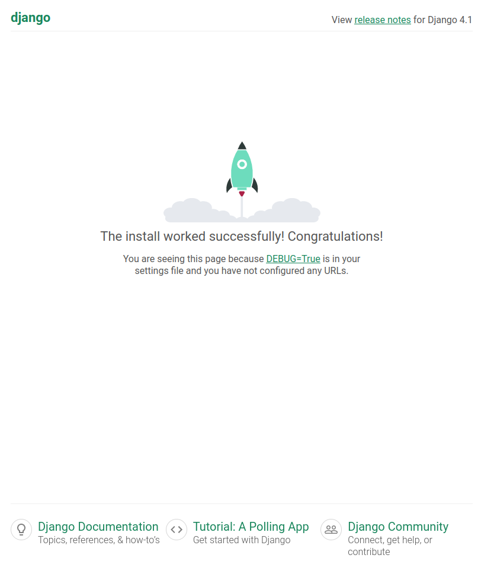
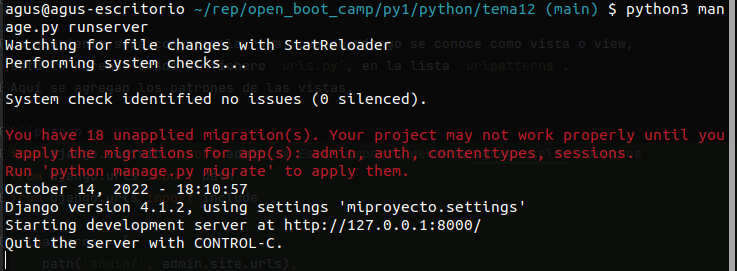
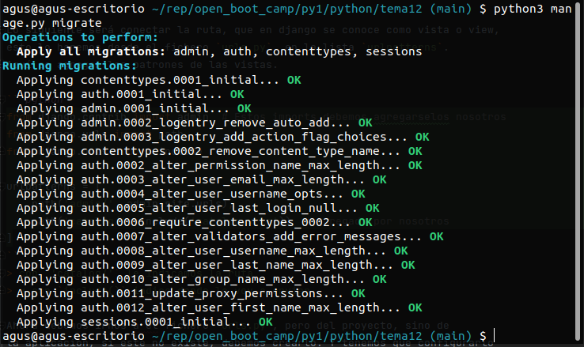

# Introducción a Django
Dajngo es un framework. Un framework es un conjunto de herramientas que nos permite
desarrollar sitios web de forma rapida, este frame wor contiene:
- modulos de autenticación
- modulos de seguridad
- Herramientas para crear usuarios iniciales
- Nos abstrae de la base de datos 

Django es de codigo abierto, y tiene una comunidad bastante grande.
Tiene un patron MTV (Module template vista).

## Instalación de django
```bash
pip install django
```

## Crear un proyecto django
```bash
django-admin startproject miproyecto . 
```
al ejecutar este comando, django configurara un conjunto de archivos:
- manage.py
Dentro de la carperta del nombre de mi proyecto:
- __init__.py
- asig.py
- settings.py  
  > Configuraciones de django
- urls.py
- wsgi.py

En django se trabaja con proyectos y aplicaciones, un proyecto es el todo. 
Un proyecto está compuesto por multiples aplicaciones, todas bajo un mismo control 
administrativo.
Cada proyecto está dividido en aplicaciones, para darse una idea, un ejemplo podría ser,
un ecommerce, tendría una aplicación para el carrito de la compra, una aplicación de usuario
y de sesión, etc.

Un proyecto en django, necesita guardar la información en algún lado, por defecto encontraremos 
la configuración de la base de datos, en el archivo `settings.py` en el diccionario `DATABASES`.

```python
# Database
# https://docs.djangoproject.com/en/4.1/ref/settings/#databases

DATABASES = {
    'default': {
        'ENGINE': 'django.db.backends.sqlite3',
        'NAME': BASE_DIR / 'db.sqlite3',
    }
}
```

## Podemos comprobar la instalación
Usando el comando en la consola:
```bash
python3 manage.py runserver
```
Y luego yendo a la dirección `localhost:8000` desde el navegador, 
deberíamos ver la siguiente página, si es que todo ha ocurrido sin 
errores.


En una ejecución profesional, django se ejecuta con `nginx` o `apache`, pero nos 
viene con un micro servidor para desarrollar de forma local, sin tener que entrar en 
las configuraciones de un servidor.

## Como se trabaja con bases de datos en la vida real:
Lo más común es que utilicemos un servicio completo para las bases de datos,
el uso de SQLite quedara solo relegado a situaciones muy puntuales.
Por ejemplo para configurar una base de datos como PostgreSQL
Deberemos configurar el diccinario `DATABASES` en `settings.py` de la siguiente manera.
```python
# Database
# https://docs.djangoproject.com/en/4.1/ref/settings/#databases

DATABASES = {
    'default': {
        'ENGINE': 'django.db.backends.postgresql',
        'NAME': 'libreria',  # Nombre de la base de datos
        'USER': 'agustin1996',
        'PASS': '',  # en este caso no le ponemos contraseña, pero debería llevar
        'HOST': 'localhost',
        'PORT': '5432'
    }
}
```
> A tener en cuenta que deberíamos tener instalado postgresql y la libreria de python, y también 
> la base de datos configurada a la que nos estamos queriendo conectar.

En el caso del profe, el comando para la creación de la base de datos de postgreSQL es:
```bash
/users/vroman/local/opt/homebrew/opt/postgresql/bin/createdb libreria
```
> Tener en cuenta: él usa mac y que en este caso libreria seria el nombre de la base de datos.

## Como se crean las aplicaciones
Desde la bash
```bash
python3 manage.py startapp catalog
```
> catalog es el nombre de la aplicación

Este comando nos creara una nueva carpeta, esta contendrá los archivos que 
django nos ha configurado por defecto, los cuales son:
- admin.py
- apps.py
- models.py
- test.py
- views.py

El siguiente paso es conectar mi aplicación `catalog` con el proyecto general `miproyecto`.
Esto lo tendremos que hacer desde el fichero `settings.py` en la lista `INSTALLED_APPS`, acá 
vamos agreagar un elemento más en la lista, que en este caso será: `'catalog.apps.Catalog.Config'`
```python
# Application definition

INSTALLED_APPS = [
    'django.contrib.admin',
    'django.contrib.auth',
    'django.contrib.contenttypes',
    'django.contrib.sessions',
    'django.contrib.messages',
    'django.contrib.staticfiles',
    'catalog.apps.CatalogConfig'
]
```

Lo siguiente será conectar la ruta, que en django se conoce como vista o view, 
esto lo haremos desde el fichero `urls.py`, en la lista `urlpatterns`.
Aquí se agregan los patrones de las vistas.

```python
from django.contrib import admin  # Estos imports debemos agregarselos nosotros
from django.urls import path
from django.urls import include

urlpatterns = [
    path('admin/', admin.site.urls),
    path('catalog/', include('catalog.urls'))  # agregado por nosotros
]
```
> con `'catalog/'` le indicamos la ruta
> y con `include()` indico donde lo voy a enviar.

Ahora debemos irnos a el fichero `urls.py`, pero del proyecto, sino de 
la aplicación, si este no existe, debemos crearlo. Y tenemos que configurarlo
de la siguiente manera.
```python

urlpatterns = []
```

Ahora al ejecutar el runserver desde la consola, no debería generarnos problemas
## Seguimos configurando generando datos
Podremos ver que si ejecutamos el server ahora, nos dara una advertencia de que hay 18 migraciones 
sin aplicar. Y que el proyecto no va a funcionar hasta que sean aplicadas.

### Prepara nuestra base de datos
```bash
python3 manage.py migrate
```

#### Creamos un superusuario de Django
```bash
python3 manage.py createsuperuser
```
Esto nos pedira varios datos que seran almacenados en la base de datos. Y
que luego nos va a servir para entrar a el panel de administracion.
Este se encuentra en [localhost:8000/admin](localhost:8000/admin).
Si entramos en users podemos ver el usuario que acabamos de crear.

### Creamos modelos
En este caso vamos a trabajar con ecommerce de libros.
Los modelos siempre los vamos a crear dentro de las aplicaciones.
Podremos ver que dentro de la carpeta de nuestra aplicación `catalog`, tenemos un
archivo que se llama `models.py`. Aquí adentro es donde se crean los modelos. 
Por ejemplo vamos a crear un modelo *genero*.
Enonces para hacer esto vamos a crear una clase: 
```python
from django.db import models

class Genere(models.Model):  # De la que heredaremos las propiedades de Model().
    name = models.CharField(max_length=64, help_text='Pon el nombre del genero')

    def __str__(self):  # Esto nos da una representación informal de una objeto
        return self.name

```
> Tener en cuenta que debemos indicar para que se pueda relacionar esta configuración de con la
> base de datos el tipo de valor que vamos a almacenar, y el tamaño que tendrá esta.


Una vez creado un modelo podremos ejecutar el comando:
```bash
python3 manage.py makemigrations
```
Esto generará ficheros dentro de la carpeta migrations de la aplicación.
Estas serán las migraciones que se van a ejecutar cuando llame al comando 
`python3 manage.py migrate`. Este comando lo que hará es ejecutar cambios en la base de datos.
Ira trabajando de manera secuencial de los archivos que se hayan generado en las carpetas `migrations`
de todas las aplicaciones.

Si ejecutamos el comando
```bash
python3 manage.py migrate
```
Veremos las migraciones que se han ejecutado. En este caso solo
veremos una, la del modelo que acabamos de agregar en `catalog/models.py`.
Y que luego creamos la instruccion de la migracion en `catalog/migrations/0001_initial.py`
con el comando `python3 manage.py makemigrations`.


Si hemos llegado hasta aca, ya hemos ejecutado todas las migraciones.

## Creamos más modelos 
Los modelos nos están vinculando clases de python con la base de datos.

```python
from django.db import models
from django.urls import reverse

class Book(models.Model):
    title = models.CharField(max_length=64)
    # Esto es una referecia o una relacion
    author = models.ForeignKey('Author', on_delete=models.SET_NULL, null=True)
    summary = models.TextField(max_length=100, help_text='Pon aguí de que va el libro')
    isbn = models.CharField('ISBN', max_length=13, help_text='El ISBN de 13 caracteres')
    genere = models.ManyToManyField(Genere)
    
    def __str__(self):
      return self.title
    
    def get_absolute_url(self):
      return reverse('book-datail', args=[str(self.id)])
    
```
El objeto `ForengKey` viene dado por el concepto de base de datos 
de llave foranea, ósea que este valor no se vá a almacenar en la tabla `Books`
si no que este campo autor se va a relacionar con una llave a la tabla autores. 

Después las configuaraciones que le damos al constructor en esta instancia es que si 
se elimina el autor en la tabla autores, el valor en la tabla `books` será null. Y que le 
damos permiso a ser null a este campo.


